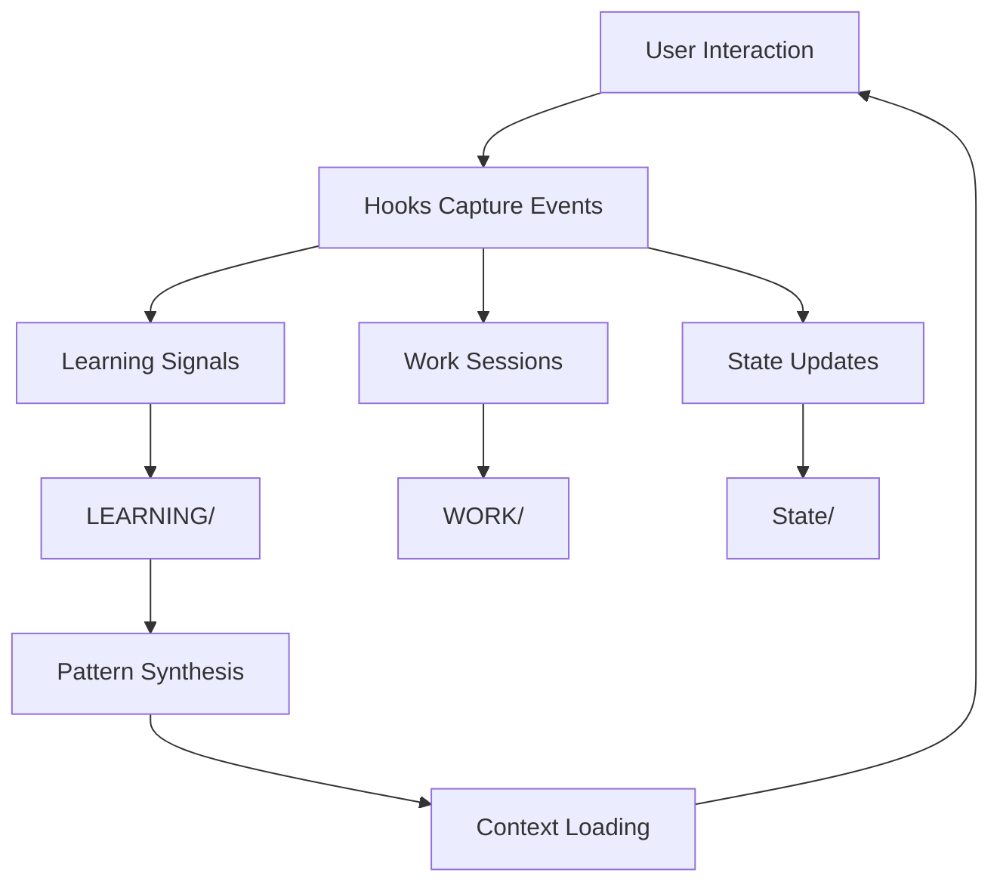

# MEMORY -- Persistent Memory Subsystem

> This directory contains personal runtime data and is excluded from the
> public repository. This README explains what it stores so you can
> understand the architecture.

## Purpose

The MEMORY subsystem provides persistent state across Claude Code sessions. It enables Kaya to learn from past interactions, maintain work context, and improve over time. This is the core differentiator that makes Kaya a "persistent" AI assistant rather than a stateless chatbot.

## Architecture



## Structure

```
MEMORY/
  WORK/                    # Work session records (one per Claude Code session)
    20260220-143052_feature-auth/
      META.yaml            # Session metadata (duration, tools, commits)
      THREAD.md            # Conversation summary
      tasks/               # Task completion records
  LEARNING/
    SIGNALS/               # Raw learning signals (ratings, sentiment)
      ratings.jsonl        # Explicit user ratings (1-10)
      context-feedback.jsonl  # Context relevance feedback
    ALGORITHM/             # Synthesized learning patterns
      2026-02/             # Monthly pattern files
    SYSTEM/                # System-level learnings
  State/
    context-session.json   # Current session context state
    context-classification.json  # Context routing state
    integrity-state.json   # System integrity checksum
    tab-title.json         # Terminal tab state
  daemon/
    cron/
      state.json           # Cron job execution state
    messages/              # Inter-process message queue
  QUEUES/                  # Work approval queues
    approvals.jsonl        # Pending approval items
    approved-work.jsonl    # Approved work items
    state.json             # Queue state
  VOICE/                   # Voice interaction event log
    voice-events.jsonl     # Timestamped voice events
  BRIEFINGS/               # Daily briefing archives
  AUTOINFO/                # Auto-discovered information
  NOTIFICATIONS/           # Notification history
  research/                # Research output archives
  entries/                 # Memory entry records
  specs/                   # Specification documents
  ContextGraph/            # Relationship graph between contexts
  Reports/                 # Generated reports
```

## How It Works

1. **Capture**: Hooks fire on session events (start, stop, tool use) and write signals to `LEARNING/SIGNALS/`
2. **Synthesize**: The ContinualLearning skill periodically aggregates raw signals into patterns in `LEARNING/ALGORITHM/`
3. **Load**: On session start, the ContextRouter hook loads relevant patterns into the conversation context
4. **Persist**: State files in `State/` maintain cross-session continuity for various subsystems

## Example Data Shapes

### Learning Signal (ratings.jsonl)
```json
{"timestamp":"2026-02-20T14:30:00Z","rating":8,"context":"bug-fix","session":"abc123"}
```

### Work Session META.yaml
```yaml
id: "20260220-143052_feature-auth"
started: "2026-02-20T14:30:52Z"
ended: "2026-02-20T15:45:00Z"
duration_minutes: 74
tools_used: ["Edit", "Bash", "Grep"]
commits: 3
files_changed: 12
```

### State File (context-session.json)
```json
{
  "activeProfile": "development",
  "loadedContexts": ["CORE", "Development"],
  "sessionStartTime": "2026-02-20T14:30:00Z"
}
```

## Setup

This directory is auto-populated by Kaya during normal operation. On a fresh install, it starts empty and grows as you interact with the system. No manual setup is required.
