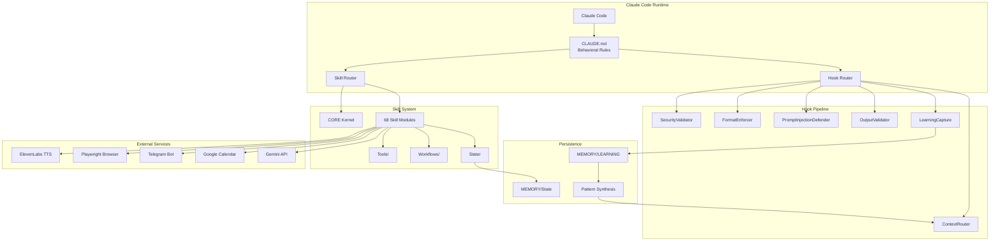
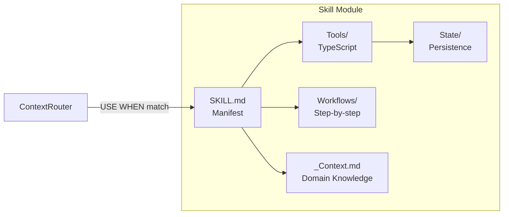
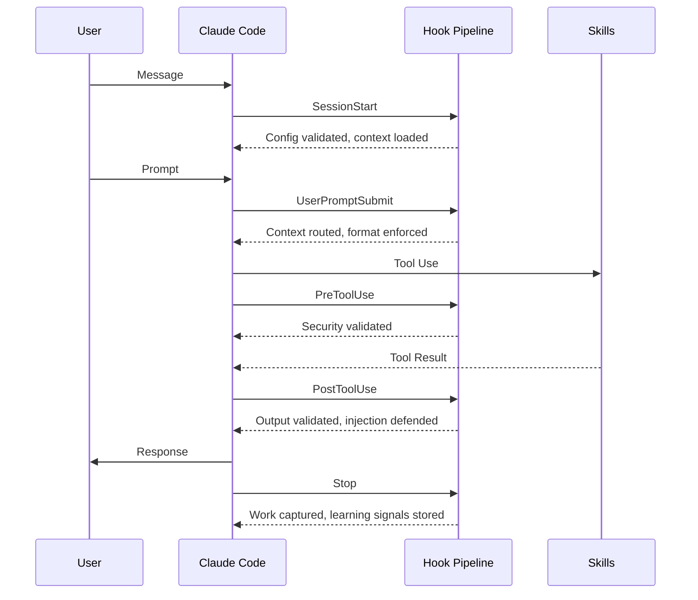
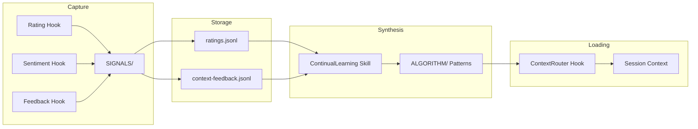
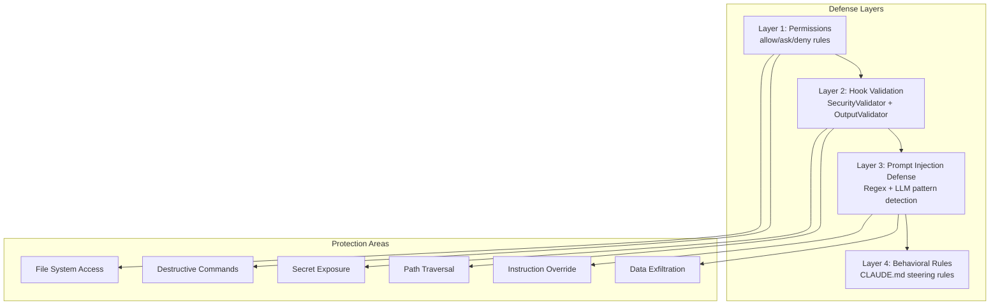

# Kaya -- Personal AI Infrastructure
[](https://github.com/jstilb/ai-assistant/actions/workflows/ci.yml)
[](https://www.typescriptlang.org/)
[](https://bun.sh/)
[](#skill-catalog)
[](#the-hook-system)
[](#the-agent-system)
[](https://docs.anthropic.com/en/docs/claude-code)
[](https://opensource.org/licenses/MIT)

> A production-grade AI agent framework with 65 composable skills, autonomous task execution, voice interaction, and persistent memory. Built on Anthropic's Claude Code as the foundation for a fully autonomous personal AI assistant.

---

## Why I Built This

After working extensively with AI assistants, I noticed a fundamental gap: every session starts from zero. There is no continuity, no memory of preferences, no ability to proactively take action. I wanted an AI system that:

- **Remembers everything** -- past decisions, preferences, learnings across sessions
- **Acts autonomously** -- executes multi-step workflows without constant supervision
- **Composes capabilities** -- chains specialized skills together for complex tasks
- **Speaks and listens** -- bidirectional voice interaction, not just text
- **Improves itself** -- learns from feedback and adjusts behavior over time

Kaya is the result: a skill-based architecture where each capability is a self-contained module that Claude Code can discover, load, and execute. The system handles everything from calendar management and grocery shopping to security reconnaissance and multi-agent debates.

---

## Architecture Overview



---

## System Design

### The Skill System

Skills are the fundamental unit of capability in Kaya. Each skill is a self-contained module with a standardized interface:



**SKILL.md** is the hero document -- it declares:
- `USE WHEN` trigger clause (how the router discovers the skill)
- Available commands and their CLI interfaces
- Workflow references for multi-step operations
- Integration points with other skills

```
skills/ExampleSkill/
  SKILL.md            # Manifest: triggers, workflows, integration
  _Context.md         # Domain knowledge loaded on demand
  Tools/              # TypeScript utilities (CLI-first)
    ToolName.ts       # Each tool: stdin -> stdout, JSON support
    __tests__/        # Test coverage
  Workflows/          # Step-by-step workflow definitions
  State/              # Runtime state (gitignored)
```

### The Hook System

Hooks are lifecycle interceptors that fire at specific points in the Claude Code session. They provide security validation, context routing, format enforcement, and learning capture without modifying the core system.



**24 Active Hooks:**

| Hook | Event | Purpose |
|------|-------|---------|
| `SecurityValidator` | PreToolUse | Validates commands against security rules |
| `PromptInjectionDefender` | PostToolUse | Detects injection attempts in tool output |
| `ContextRouter` | UserPromptSubmit | Routes context based on request classification |
| `FormatEnforcer` | UserPromptSubmit | Enforces response format compliance |
| `OutputValidator` | PostToolUse | Validates tool output integrity |
| `ConfigValidator` | SessionStart | Validates system configuration |
| `StartupGreeting` | SessionStart | Displays startup banner with system stats |
| `LoadContext` | SessionStart | Loads core context into session |
| `CheckVersion` | SessionStart | Checks for system updates |
| `AutoWorkCreation` | UserPromptSubmit | Creates work session records |
| `ExplicitRatingCapture` | UserPromptSubmit | Captures user ratings (1-10) |
| `ImplicitSentimentCapture` | UserPromptSubmit | Detects sentiment from conversation |
| `UpdateTabTitle` | UserPromptSubmit | Updates terminal tab with current task |
| `SetQuestionTab` | PreToolUse | Sets tab state for pending questions |
| `QuestionAnswered` | PostToolUse | Clears question tab state |
| `CommitWorkReminder` | PostToolUse | Reminds to commit work periodically |
| `StopOrchestrator` | Stop | Orchestrates session stop activities |
| `ContextFeedback` | SessionEnd | Captures context relevance feedback |
| `WorkValidator` | SessionEnd | Validates work session integrity |
| `WorkCompletionLearning` | SessionEnd | Extracts learnings from completed work |
| `SessionSummary` | SessionEnd | Writes session summary to MEMORY |
| `AgentOutputCapture` | SubagentStop | Captures sub-agent outputs |
| `WorktreeCleanup` | SubagentStop | Cleans up git worktrees |

### The Agent System

Kaya supports 12 specialized agent personalities that can be composed for complex tasks:

| Agent | Role | Specialization |
|-------|------|---------------|
| **Engineer** | Implementation | TDD, architecture, production code |
| **Architect** | Design | System design, trade-off analysis |
| **Designer** | UX/UI | Visual design, user experience |
| **Algorithm** | Execution | Task orchestration, workflow management |
| **Pentester** | Security | Vulnerability assessment, red teaming |
| **QATester** | Quality | Testing, validation, edge cases |
| **Artist** | Creative | Visual content, image generation |
| **Intern** | General | Parallel task execution, research |
| **ClaudeResearcher** | Research | Claude-based deep research |
| **GeminiResearcher** | Research | Gemini-based research |
| **GrokResearcher** | Research | Grok-based research |
| **CodexResearcher** | Research | Multi-model code research |

**Multi-Agent Orchestration:**
- **Delegation**: Spawn parallel agents for independent tasks
- **Council**: Multi-agent debate for complex decisions
- **Branch Isolation**: Each agent works on its own git branch
- **Background Delegation**: Non-blocking agent execution

### The Memory System



The memory system creates a feedback loop:
1. **Capture**: Hooks capture explicit ratings and implicit sentiment during sessions
2. **Store**: Raw signals are appended to JSONL files in `MEMORY/LEARNING/SIGNALS/`
3. **Synthesize**: The ContinualLearning skill aggregates signals into patterns
4. **Load**: The ContextRouter loads relevant patterns into future sessions

### The Security System



**Key Security Features:**
- **Three-tier permission model**: `allow` (auto-approve), `ask` (require confirmation), `deny` (block)
- **Pre-tool-use validation**: Every Bash, Read, Write, and Edit command passes through SecurityValidator
- **Post-tool-use injection defense**: All tool outputs are scanned for prompt injection patterns
- **Destructive operation gates**: Force push, rm -rf, DROP DATABASE require explicit confirmation
- **Secret isolation**: API keys stored in `secrets.json` (gitignored), never in tracked files

### The Voice System

The VoiceServer provides text-to-speech via ElevenLabs with WebSocket streaming:

- **Desktop**: Local voice output via the menubar app
- **Mobile**: Telegram bot integration for voice messages
- **Per-Agent Voices**: Each agent personality has its own voice configuration
- **Streaming**: WebSocket-based for low-latency speech output

### The Autonomous Work System

The AutonomousWork skill enables parallel task execution:

1. **Spec-Driven**: Work items are defined with specifications and success criteria (ISC)
2. **Branch Isolation**: Each work item runs on its own git branch
3. **Parallel Execution**: Multiple Claude Code instances work simultaneously
4. **Verification**: Built-in verification against ISC before completion
5. **Learning**: Work completion triggers learning signal capture

---

## Skill Catalog

| Category | Skills | Description |
|----------|--------|-------------|
| **Core** | CORE, System, THEALGORITHM, Algorithm | System kernel, maintenance, execution engines |
| **Agents** | Agents, AgentMonitor, Council, Simulation, AgentProjectSetup | Multi-agent orchestration, evaluation, and project setup |
| **Productivity** | CalendarAssistant, DailyBriefing, LucidTasks, QueueRouter | Calendar, briefings, task management, work queues |
| **Development** | CreateCLI, CreateSkill, Browser, UIBuilder, DevGraph | CLI generation, skill scaffolding, browser automation |
| **Research** | OSINT, Recon, FirstPrinciples, RedTeam, Research | Intelligence gathering, analysis, adversarial testing |
| **Content** | ContentAggregator, Fabric, Obsidian, KnowledgeGraph, Graph | RSS pipelines, knowledge management, note transformation |
| **Commerce** | Shopping, Instacart, Cooking | Product search, grocery automation, recipe management |
| **Communication** | Telegram, VoiceInteraction, Canvas | Messaging, voice interaction, visual collaboration |
| **Security** | WebAssessment, PromptInjection, KAYASECURITYSYSTEM | Security testing, injection defense, threat models |
| **Meta** | SkillAudit, SpecSheet, Evals, KayaUpgrade, AutoMaintenance | Self-improvement, quality assurance, system maintenance |
| **Learning** | ContinualLearning, DigitalMaestro, ContextManager | Feedback loops, adaptive learning, context routing |
| **Creativity** | Art, BeCreative, Designer, Prompting, DnD | Visual content, extended thinking, design, meta-prompting |
| **Data** | Apify, BrightData, GeminiSync, Documents, ArgumentMapper | Web scraping, data sync, document processing |
| **Automation** | AutonomousWork, ProactiveEngine, _RALPHLOOP, AutoInfoManager | Parallel execution, proactive actions, autonomous iteration |
| **Career** | CommunityOutreach | Networking, outreach (State/ excluded) |
| **Goals** | Telos, Anki | Goal tracking, spaced repetition learning |
| **System** | SystemFlowchart, UnixCLI, InformationManager | System visualization, CLI tools, info management |

---

## Key Engineering Decisions

- [ADR-001: Skill-based Architecture](docs/decisions/001-skill-based-architecture.md) -- Why skills over plugins
- [ADR-002: Memory Persistence](docs/decisions/002-memory-persistence.md) -- How cross-session memory works

---

## What's Not Included

This is a sanitized version of a production personal AI system. The following are excluded for privacy:

| Component | Reason | Architecture |
|-----------|--------|-------------|
| `MEMORY/` contents | Personal work history, learning signals | See [MEMORY/README.md](MEMORY/README.md) |
| `context/` contents | Personal calendar, projects, notes | See [context/README.md](context/README.md) |
| `secrets.json` | API keys and credentials | See [secrets.example.json](secrets.example.json) |
| `skills/CORE/USER/` personal files | Identity, contacts, resume, goals | See [USER/README.md](skills/CORE/USER/README.md) |
| `skills/*/State/` contents | Runtime state data | Each has a `State/README.md` explaining the schema |
| `history.jsonl` | Conversation logs | Session-specific, auto-generated |
| `.git/` history | May contain historical secrets | Fresh repo, no history |

Every excluded directory contains a README.md explaining its architecture, data shapes, and how to set it up.

---

## Tech Stack

| Layer | Technology | Purpose |
|-------|-----------|---------|
| **Runtime** | [Bun](https://bun.sh/) | TypeScript/JavaScript execution |
| **AI Foundation** | [Claude Code](https://docs.anthropic.com/en/docs/claude-code) | Core AI reasoning engine |
| **Voice** | [ElevenLabs](https://elevenlabs.io/) | Text-to-speech with WebSocket streaming |
| **Browser** | [Playwright](https://playwright.dev/) | Browser automation and testing |
| **Messaging** | Telegram Bot API | Mobile voice interaction channel |
| **Calendar** | Google Calendar CLI | Calendar automation |
| **State** | JSON/JSONL + SQLite | Persistent state with validation |
| **Scheduling** | macOS launchd | Cron-style task automation |
| **Security** | Custom hook pipeline | Multi-layer defense system |

---

## Quick Start

```bash
# 1. Clone the repository
git clone https://github.com/your-username/kaya.git ~/.claude
cd ~/.claude

# 2. Install dependencies
bun install

# 3. Run the setup wizard
bun run install.ts

# 4. Configure your secrets
cp secrets.example.json secrets.json
# Edit secrets.json with your API keys

# 5. Start the voice server (optional)
cd VoiceServer && ./install.sh && ./start.sh

# 6. Launch Claude Code
claude
```

See [INSTALL.md](INSTALL.md) for detailed setup instructions including prerequisites and configuration options.

---

## Documentation

- [Installation Guide](INSTALL.md) -- Prerequisites, setup, and configuration
- [Architecture](docs/architecture.md) -- System design and data flow
- [ADR-001: Skill-based Architecture](docs/decisions/001-skill-based-architecture.md)
- [ADR-002: Memory Persistence](docs/decisions/002-memory-persistence.md)
- [Voice Server](VoiceServer/README.md) -- TTS server setup and usage
- [Security System](KAYASECURITYSYSTEM/README.md) -- Security architecture

---

## Related Projects

This project is part of a broader AI engineering portfolio:

- [mcp-toolkit-server](https://github.com/jstilb/mcp-toolkit-server) — MCP server with tools for file system, web search, and code execution that powers Kaya's external capabilities
- [context-engineering-toolkit](https://github.com/jstilb/context-engineering-toolkit) — Utilities for optimizing LLM context windows, prompt compression, and retrieval strategies
- [meaningful_metrics](https://github.com/jstilb/meaningful_metrics) — Evaluation framework for measuring AI system effectiveness against human-centered outcomes
- [agent-orchestrator](https://github.com/jstilb/agent-orchestrator) — Multi-agent coordination framework for complex autonomous task execution

---

## License

MIT
