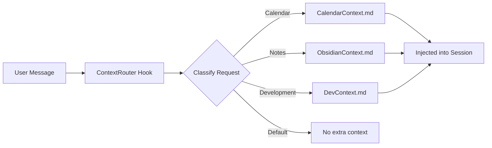

# context/ -- Dynamic Context System

> This directory stores dynamically-generated context files that are loaded
> into Claude Code sessions based on the user's request. Excluded from the
> public repository as files contain personal project and preference data.

## Purpose

The ContextManager skill generates context files that provide domain-specific knowledge to Kaya on demand. When a user asks about a topic (e.g., "check my calendar"), the ContextRouter hook identifies the relevant context file and injects it into the conversation.

## How Context Routing Works



## Expected Files

| File | Trigger | Content |
|------|---------|---------|
| `CalendarContext.md` | Calendar, schedule, meetings | Upcoming events, free/busy times |
| `ObsidianContext.md` | Notes, knowledge, research | Vault structure, recent notes |
| `DevContext.md` | Code, projects, repos | Active projects, recent changes |
| `LearningContext.md` | Learning, patterns | Synthesized learning signals |
| `DailyContext.md` | Morning, briefing, status | Today's agenda and priorities |

## Example Context File

```markdown
---
tags: [context, ai-context, calendar]
last_updated: 2026-02-20T07:00:00Z
gathered_by: CalendarAssistant
---

# Calendar Context

## Today's Schedule
| Time | Event | Location |
|------|-------|----------|
| 9:00 AM | Team Standup | Zoom |
| 2:00 PM | Design Review | Conference Room A |

## This Week
- 3 meetings remaining
- Thursday: dentist appointment
- Friday: project deadline
```

## Setup

Context files are generated by their respective skills (CalendarAssistant, InformationManager, etc.) and refreshed on a schedule via the daemon cron system. On a fresh install, this directory starts empty and populates as you configure and use skills.
