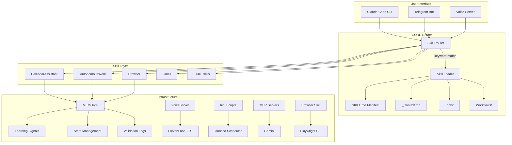
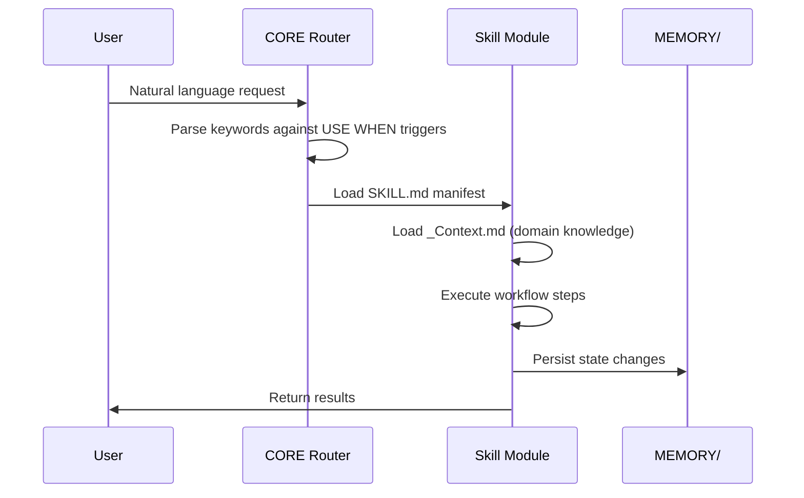
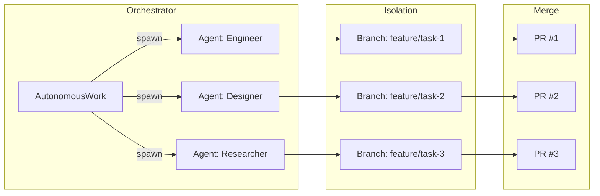

# Architecture

## System Overview

Kaya is a skill-based AI agent infrastructure built on Claude Code. The system enables an LLM to dynamically discover, load, and execute specialized capabilities through a composable skill architecture with persistent memory.

## High-Level Architecture



## Skill Discovery and Loading



## Multi-Agent Execution



## Key Design Decisions

### 1. Markdown-First Skill Definitions

Skills are defined in Markdown rather than code. This means:
- Claude Code can read and understand skill capabilities natively
- No compilation step -- skills are discovered at runtime
- Human-readable documentation doubles as machine-readable configuration
- The `USE WHEN` trigger clause enables keyword-based routing

### 2. Persistent Memory via JSON State Files

State is stored as JSON files in `MEMORY/` rather than a database because:
- Git-trackable state changes
- No infrastructure dependencies
- Human-readable for debugging
- Atomic file writes prevent corruption

### 3. Branch-Isolated Parallel Execution

When multiple agents work simultaneously, each operates on its own git branch. This prevents:
- File conflicts between concurrent agents
- Cross-contamination of commits
- Race conditions on shared state files

### 4. Voice as a First-Class Channel

The voice server runs as a persistent background service (via launchd) so that:
- Agents can speak without user interaction
- Notifications are audible, not just visual
- Mobile interaction via Telegram voice messages is seamless

## Data Flow

```
User Request
    |
    v
CORE Router (keyword matching)
    |
    v
Skill SKILL.md (manifest + triggers)
    |
    v
_Context.md (domain knowledge)
    |
    v
Workflow Execution (Tools/, Workflows/)
    |
    +---> External APIs (Google, Telegram, ElevenLabs)
    |
    +---> MCP Servers (Gemini)
    |
    +---> Browser Skill (Playwright CLI via Browse.ts)
    |
    +---> MEMORY/ (state persistence)
    |
    v
User Response (text, voice, or action)
```
