# Kaya System Architecture

**Generated:** 2026-01-24 18:40 PST
**Kaya Version:** v2.3
**Skills:** 57
**Hooks:** 19

---

## Table of Contents

1. [System Overview](#1-system-overview)
2. [Session Lifecycle](#2-session-lifecycle)
3. [Skill Ecosystem](#3-skill-ecosystem)
4. [Memory System](#4-memory-system)
5. [Configuration Flow](#5-configuration-flow)
6. [Agent Architecture](#6-agent-architecture)
7. [Workflow Routing](#7-workflow-routing)
8. [Hook Reference](#8-hook-reference)
9. [Security Architecture](#9-security-architecture)
10. [Core Infrastructure Tools](#10-core-infrastructure-tools)

---

## 1. System Overview

Kaya (Personal AI Infrastructure) is a personalized agentic system designed to help people accomplish their goals in life. The system achieves *Euphoric Surprise* through results that are thorough, thoughtful, and effective.

### Founding Principles

1. **Customization for Your Goals** - Kaya exists to help achieve your specific objectives
2. **The Algorithm** - Current State → Ideal State via ISC-driven iteration
3. **Continuously Upgrading System** - Learns from every interaction
4. **CLI-First Design** - Core tools are command-line utilities
5. **Code Before Prompts** - Typed, reusable infrastructure over ad-hoc prompts
6. **Determinism & Reproducibility** - Verifiable outputs, not luck-based

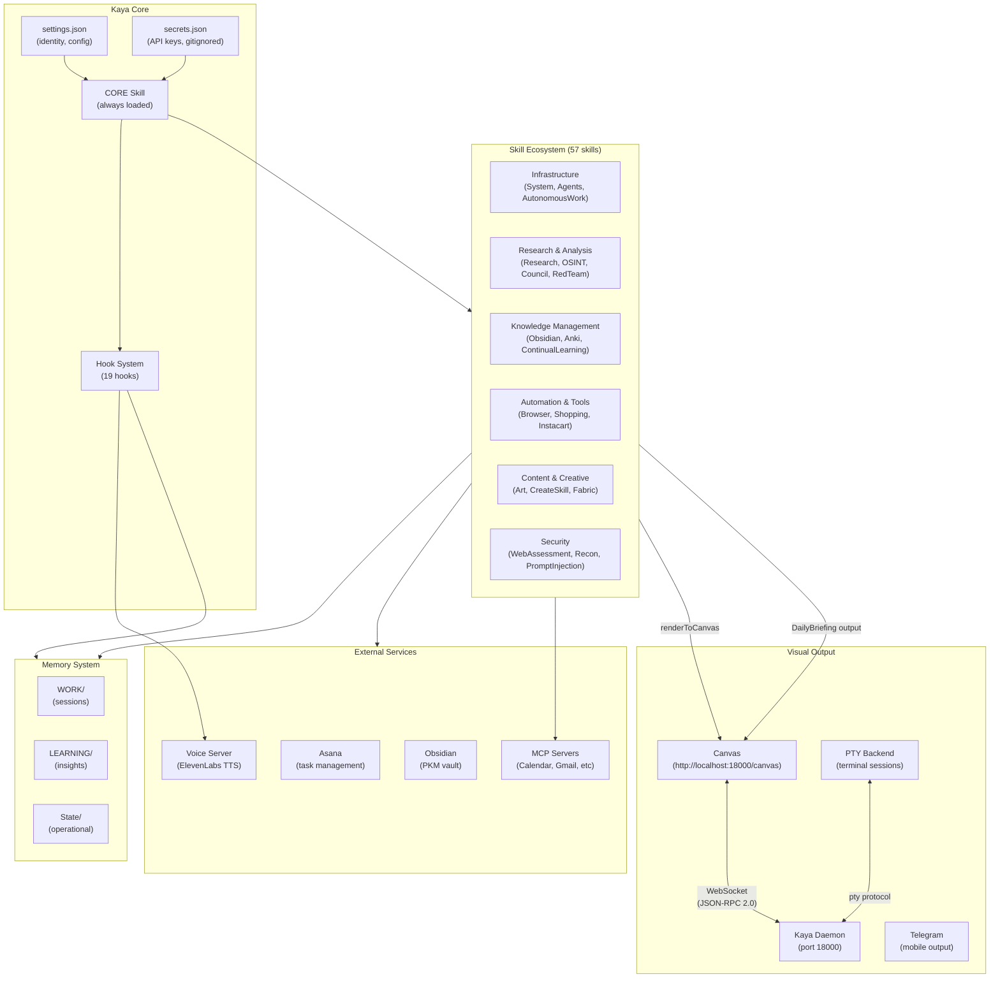

---

## 2. Session Lifecycle

Complete flow from session start to termination, showing all hook execution points.

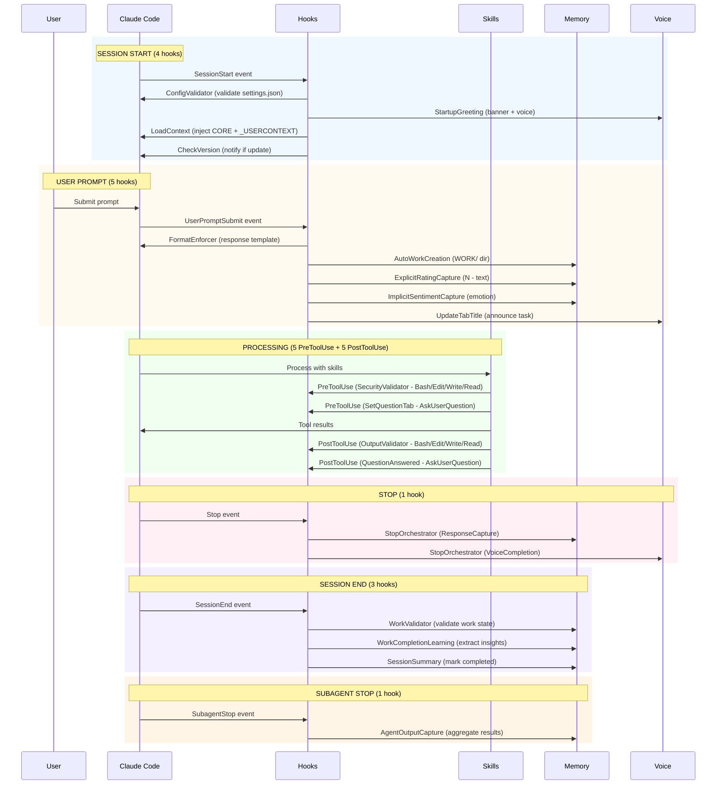

---

## 3. Skill Ecosystem

### 3.1 Skill Categories

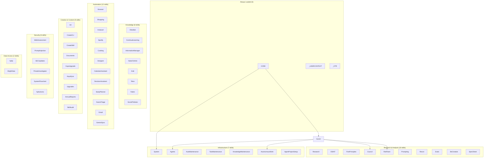

### 3.2 Skill Dependency Graph

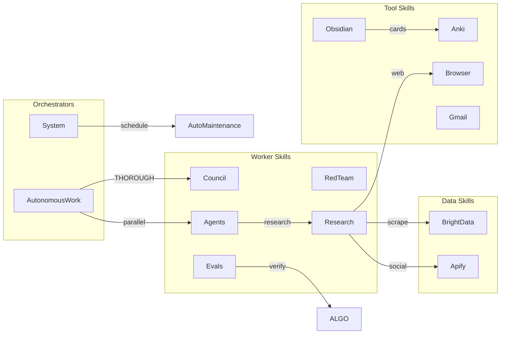

### 3.3 Complete Skill List (57 skills)

| Category | Skills |
|----------|--------|
| **Always Loaded** | CORE, _USERCONTEXT, _DTR |
| **Infrastructure** | System, Agents, AutoMaintenance, AutonomousWork, TaskMaintenance, KnowledgeMaintenance, AgentProjectSetup |
| **Research & Analysis** | Research, OSINT, FirstPrinciples, Council, RedTeam, Prompting, Recon, Evals, BeCreative, SpecSheet |
| **Knowledge** | Obsidian, ContinualLearning, InformationManager, NotesToAnki, Anki, Telos, Fabric, SocialToNotes |
| **Automation** | Browser, Shopping, Instacart, Spotify, Cooking, Designer, CalendarAssistant, DecisionAssistant, StudyPlanner, AsanaTriage, Gmail, GeminiSync |
| **Creative & Content** | Art, CreateCLI, CreateSkill, Documents, KayaUpgrade, KayaSync, Upgrades, AnnualReports, SkillAudit |
| **Security** | WebAssessment, PromptInjection, SECUpdates, PrivateInvestigator, SystemFlowchart, Aphorisms |
| **Data Access** | Apify, BrightData |

---

## 4. Memory System

### 4.1 Directory Structure

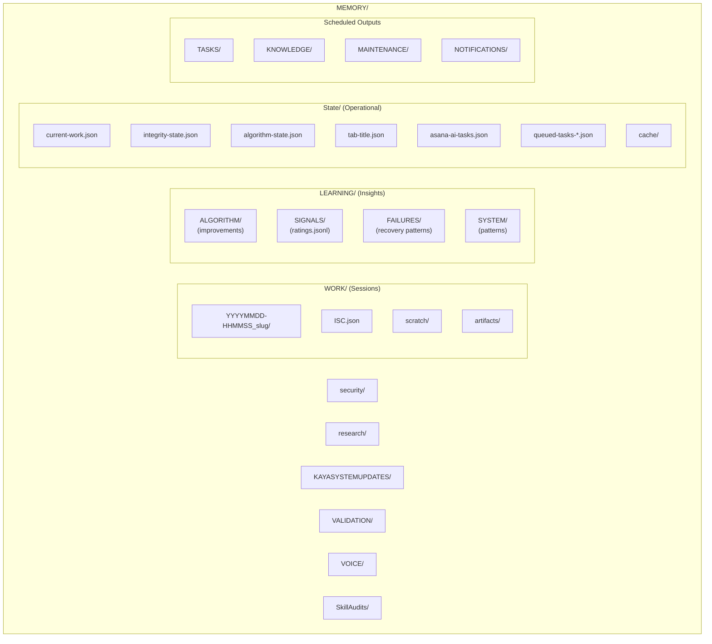

### 4.2 Data Flow

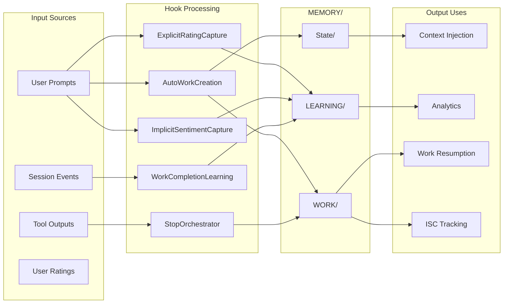

### 4.3 Retention Policies

| Data Type | Location | Retention |
|-----------|----------|-----------|
| Sessions | WORK/ | Indefinite |
| Learnings | LEARNING/ | Permanent |
| Security Events | security/ | Permanent |
| Recovery Snapshots | recovery/ | 7 days |
| Execution Logs | execution/ | 30 days |
| Cache | State/cache/ | TTL-based |

---

## 5. Configuration Flow

### 5.1 SYSTEM/USER Two-Tier Pattern

```mermaid
flowchart LR
    subgraph Settings["settings.json"]
        Identity["daidentity\n(name, voice)"]
        Principal["principal\n(user info)"]
        HookConfig["hooks\n(lifecycle)"]
        Permissions["permissions\n(allow/deny/ask)"]
        Plugins["enabledPlugins\n(playwright, etc)"]
    end

    subgraph Secrets["secrets.json (gitignored)"]
        ElevenLabs["ELEVENLABS_API_KEY"]
        Asana["ASANA_ACCESS_TOKEN"]
        Gemini["GEMINI_API_KEY"]
    end

    subgraph SYSTEM["SYSTEM/ (Defaults)"]
        SysResponse["RESPONSEFORMAT.md"]
        SysSecurity["KAYASECURITYSYSTEM/"]
        SysRules["AISTEERINGRULES.md"]
        SysDocs["Documentation/*.md"]
    end

    subgraph USER["USER/ (Overrides)"]
        UserResponse["RESPONSEFORMAT.md"]
        UserSecurity["KAYASECURITYSYSTEM/"]
        UserRules["AISTEERINGRULES.md"]
        UserAssets["ASSETMANAGEMENT.md"]
        UserContacts["CONTACTS.md"]
        UserStack["TECHSTACKPREFERENCES.md"]
    end

    Settings --> SYSTEM
    Secrets --> CORE["CORE Skill"]
    SYSTEM --> USER
    USER -->|"USER exists?"| Final["Active Config"]
    SYSTEM -->|"No USER"| Final
```

### 5.2 Configuration Priority

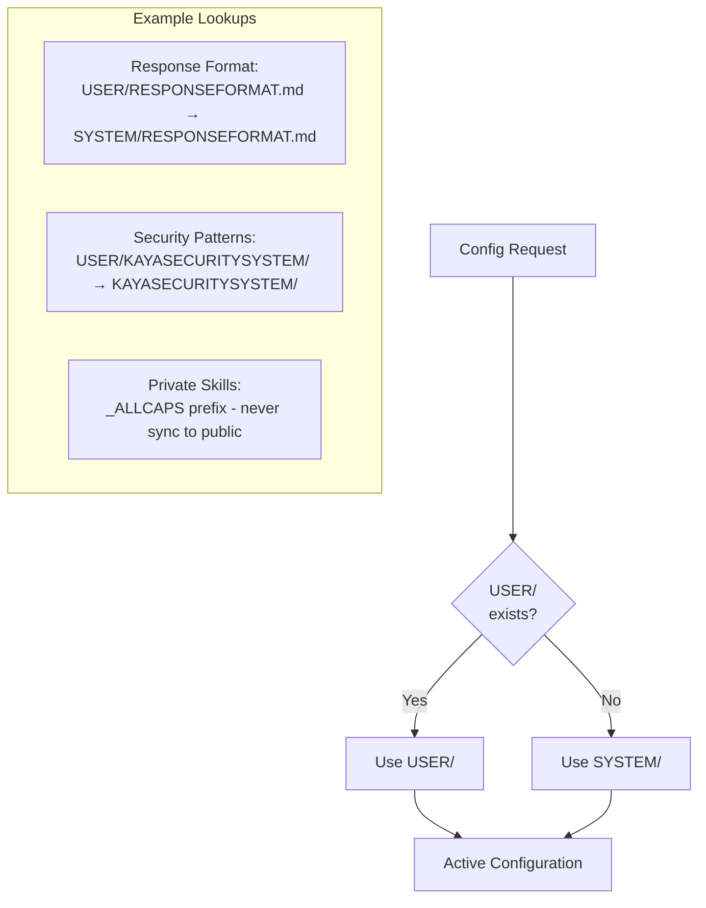

---

## 6. Agent Architecture

### 6.1 Three-Tier Agent Model

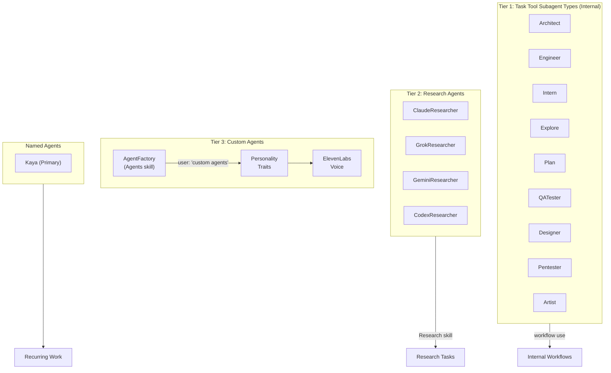

### 6.2 Agent Selection Guide

| Agent Type | Trigger | Use Case |
|------------|---------|----------|
| **Architect** | Complex design needs | System architecture, planning |
| **Engineer** | Implementation work | TDD, code writing |
| **Intern** | Parallel grunt work | Data collection, simple tasks |
| **Explore** | Codebase search | Finding files, understanding code |
| **Plan** | Approach planning | Implementation strategies |
| **QATester** | Validation | Browser testing, verification |
| **Research Agents** | `/research` or Research skill | Multi-source synthesis |
| **Custom Agents** | "custom agents", "spin up agents" | Unique personalities |

---

## 7. Workflow Routing

### 7.1 Intent Detection Flow

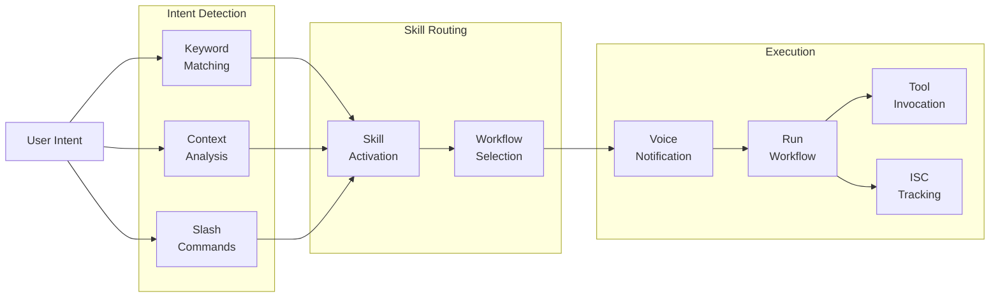

### 7.2 Key Trigger Mappings

| User Says | Skill | Workflow |
|-----------|-------|----------|
| "audit system", "integrity check" | System | IntegrityCheck |
| "create diagram", "visualize" | Art | Visualize |
| "run council", "debate" | Council | Debate |
| "custom agents", "spin up agents" | Agents | AgentFactory |
| "remember this", "save for later" | ContinualLearning | Capture |
| "system diagram", "update flowchart" | SystemFlowchart | GenerateArchitecture |
| "iterate until" | AutonomousWork | ralph_loop mode |
| "security scan" | System | SecurityScan |
| "browser", "screenshot" | Browser | Navigate |
| "triage tasks" | AsanaTriage | ReviewTasks |

### 7.3 Core Workflows (CORE/Workflows/)

| Workflow | Purpose |
|----------|---------|
| **Delegation.md** | Spawn parallel agents for complex tasks |
| **BackgroundDelegation.md** | Launch non-blocking agents |
| **TreeOfThought.md** | Structured decision-making |
| **GitPush.md** | Push changes with proper commits |
| **SessionContinuity.md** | Maintain context across sessions |
| **SessionCommit.md** | Commit session work to git |
| **HomeBridgeManagement.md** | Smart home automation |
| **ImageProcessing.md** | Image analysis workflows |
| **Transcription.md** | Audio transcription processing |

---

## 8. Hook Reference

### 8.1 All Hooks (19 files, 24 registrations)

| Hook | Event | Matcher | Purpose |
|------|-------|---------|---------|
| ConfigValidator | SessionStart | - | Validate settings.json schema |
| StartupGreeting | SessionStart | - | Display banner, voice catchphrase |
| LoadContext | SessionStart | - | Inject CORE + _USERCONTEXT |
| CheckVersion | SessionStart | - | Notify of Claude Code updates |
| FormatEnforcer | UserPromptSubmit | - | Inject response format template |
| AutoWorkCreation | UserPromptSubmit | - | Create WORK/ directory |
| ExplicitRatingCapture | UserPromptSubmit | - | Parse "N - text" ratings |
| ImplicitSentimentCapture | UserPromptSubmit | - | Haiku inference on emotion |
| UpdateTabTitle | UserPromptSubmit | - | Kitty tab + voice announcement |
| SecurityValidator | PreToolUse | Bash | Command safety validation |
| SecurityValidator | PreToolUse | Edit | File modification validation |
| SecurityValidator | PreToolUse | Write | File creation validation |
| SecurityValidator | PreToolUse | Read | File read validation |
| SetQuestionTab | PreToolUse | AskUserQuestion | Set question tab state |
| OutputValidator | PostToolUse | Bash | Command output validation |
| OutputValidator | PostToolUse | Edit | Edit success validation |
| OutputValidator | PostToolUse | Write | Write success validation |
| OutputValidator | PostToolUse | Read | Read success validation |
| QuestionAnswered | PostToolUse | AskUserQuestion | Reset tab after question |
| StopOrchestrator | Stop | - | Response capture + voice |
| WorkValidator | SessionEnd | - | Validate work session state |
| WorkCompletionLearning | SessionEnd | - | Extract learnings (Opus) |
| SessionSummary | SessionEnd | - | Mark work completed |
| AgentOutputCapture | SubagentStop | - | Capture subagent results |

### 8.2 Hook Execution Timeline

```mermaid
gantt
    title Hook Execution Timeline
    dateFormat X
    axisFormat %s

    section SessionStart
    ConfigValidator     :0, 1
    StartupGreeting     :1, 2
    LoadContext         :2, 3
    CheckVersion        :3, 4

    section UserPromptSubmit
    FormatEnforcer      :4, 5
    AutoWorkCreation    :5, 6
    ExplicitRatingCapture :5, 6
    ImplicitSentimentCapture :5, 6
    UpdateTabTitle      :5, 6

    section PreToolUse
    SecurityValidator   :6, 7
    SetQuestionTab      :6, 7

    section PostToolUse
    OutputValidator     :7, 8
    QuestionAnswered    :7, 8

    section Stop
    StopOrchestrator    :8, 9

    section SessionEnd
    WorkValidator       :9, 10
    WorkCompletionLearning :9, 10
    SessionSummary      :9, 10

    section SubagentStop
    AgentOutputCapture  :10, 11
```

### 8.3 Hook Utilities (hooks/lib/)

| Utility | Purpose |
|---------|---------|
| paths.ts | Path resolution and environment variables |
| identity.ts | Identity configuration from settings.json |
| notifications.ts | Notification service integration |
| observability.ts | Logging and trace emission |
| metadata-extraction.ts | Extract context from responses |
| response-format.ts | Response format validation |
| time.ts | Timezone-aware time utilities |
| learning-utils.ts | Learning capture patterns |
| change-detection.ts | Detect system state changes |
| work-utils.ts | Work session management |
| recovery-types.ts | Error recovery patterns |
| TraceEmitter.ts | Structured event tracing |

---

## 9. Security Architecture

### 9.1 Permission Levels

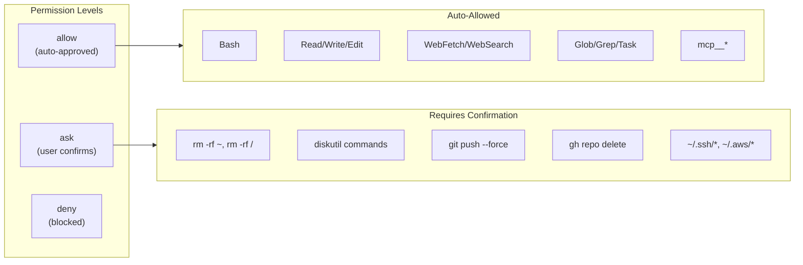

### 9.2 Security Validation Flow

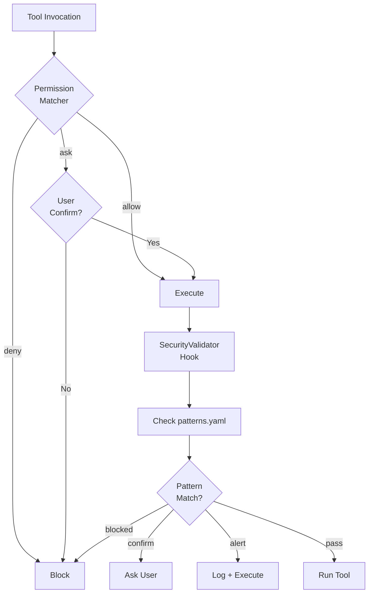

### 9.3 Repository Security

| Repository | Purpose | Rules |
|------------|---------|-------|
| **Private ($KAYA_HOME)** | Personal instance | Never push public, contains sensitive data |
| **Public (danielmiessler/Kaya)** | Template | Sanitized examples only |

**Before every commit:** Run `git remote -v` to verify correct repository.

### 9.4 Secrets Management

**Location:** `$KAYA_HOME/secrets.json` (gitignored)

| Secret | Purpose |
|--------|---------|
| ELEVENLABS_API_KEY | Voice server TTS |
| ELEVENLABS_VOICE_ID | Default voice ID |
| ASANA_ACCESS_TOKEN | Task management |
| GEMINI_API_KEY | Gemini MCP integration |

---

## 10. Core Infrastructure Tools

Located in `lib/core/`:

| Tool | Purpose | Use When |
|------|---------|----------|
| **StateManager** | Type-safe state persistence | Managing JSON state files, queues, caches |
| **NotificationService** | Multi-channel notifications | Voice, push, discord alerts |
| **ConfigLoader** | SYSTEM/USER tiered config | Loading skill configs, settings.json |
| **CachedHTTPClient** | HTTP with caching, retry | Fetching URLs, API calls |
| **MemoryStore** | Unified memory storage | Capturing learnings, research, sessions |
| **ApprovalQueue** | Approval workflows | Human-in-loop decisions |
| **AgentOrchestrator** | Parallel agent spawning | Multi-agent work, spotcheck |
| **WorkflowExecutor** | Workflow execution | Daily/Weekly/Monthly maintenance |

---

## Quick Reference

### File Locations

| Component | Path |
|-----------|------|
| Settings | `~/.claude/settings.json` |
| Secrets | `~/.claude/secrets.json` |
| Skills | `~/.claude/skills/` |
| Hooks | `~/.claude/hooks/` |
| Memory | `~/.claude/MEMORY/` |
| Voice Server | `~/.claude/VoiceServer/` |
| Tools | `~/.claude/tools/` |
| Plans | `~/.claude/Plans/` |
| Observability | `~/.claude/Observability/` |

### Key State Files

| File | Purpose |
|------|---------|
| `MEMORY/State/current-work.json` | Active work session pointer |
| `MEMORY/State/integrity-state.json` | System health check throttling |
| `MEMORY/State/algorithm-state.json` | Algorithm execution state |
| `MEMORY/LEARNING/SIGNALS/ratings.jsonl` | User rating signals |
| `MEMORY/security/` | Security audit log |

### Enabled Plugins

| Plugin | Purpose |
|--------|---------|
| playwright | Browser automation |
| audit-context-building@trailofbits | Code analysis |
| differential-review@trailofbits | PR security review |
| static-analysis@trailofbits | CodeQL/Semgrep |
| variant-analysis@trailofbits | Bug variant hunting |
| sharp-edges@trailofbits | Footgun detection |

---

*Generated by SystemFlowchart skill*
*For updates, run: "update architecture diagram" or "review Kaya system"*
