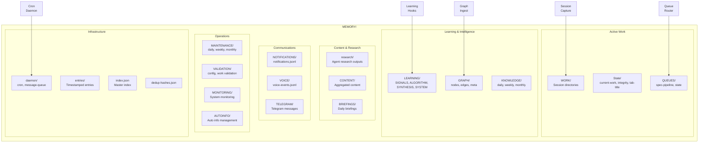

# Memory Structure

MEMORY/ directory organization and data flow

**Generated:** 2026-02-28T01:12:11.170Z

```mermaid
flowchart TB
    subgraph MEMORY["MEMORY/"]
        direction TB

        subgraph ActiveWork["Active Work"]
            WORK["WORK/<br/>Session directories"]
            State["State/<br/>current-work, integrity, tab-title"]
            QUEUES["QUEUES/<br/>spec-pipeline, state"]
        end

        subgraph Intelligence["Learning & Intelligence"]
            LEARNING["LEARNING/<br/>SIGNALS, ALGORITHM, SYNTHESIS, SYSTEM"]
            GRAPH["GRAPH/<br/>nodes, edges, meta"]
            KNOWLEDGE["KNOWLEDGE/<br/>daily, weekly, monthly"]
        end

        subgraph Content["Content & Research"]
            research["research/<br/>Agent research outputs"]
            CONTENT["CONTENT/<br/>Aggregated content"]
            BRIEFINGS["BRIEFINGS/<br/>Daily briefings"]
        end

        subgraph Comms["Communications"]
            NOTIFICATIONS["NOTIFICATIONS/<br/>notifications.jsonl"]
            VOICE["VOICE/<br/>voice-events.jsonl"]
            TELEGRAM["TELEGRAM/<br/>Telegram messages"]
        end

        subgraph Operations["Operations"]
            MAINTENANCE["MAINTENANCE/<br/>daily, weekly, monthly"]
            VALIDATION["VALIDATION/<br/>config, work validation"]
            MONITORING["MONITORING/<br/>System monitoring"]
            AUTOINFO["AUTOINFO/<br/>Auto info management"]
        end

        subgraph Infrastructure["Infrastructure"]
            daemon["daemon/<br/>cron, message-queue"]
            entries["entries/<br/>Timestamped entries"]
            index["index.json<br/>Master index"]
            dedup["dedup-hashes.json"]
        end
    end

    %% Data flows
    SessionCapture["Session<br/>Capture"] --> WORK
    LearningCapture["Learning<br/>Hooks"] --> LEARNING
    GraphIngest["Graph<br/>Ingest"] --> GRAPH
    QueueRouting["Queue<br/>Router"] --> QUEUES
    CronJobs["Cron<br/>Daemon"] --> daemon

    classDef memory fill:#4c1d95,stroke:#c4b5fd,color:#fff
    classDef flow fill:#1e3a5f,stroke:#93c5fd,color:#fff
```
