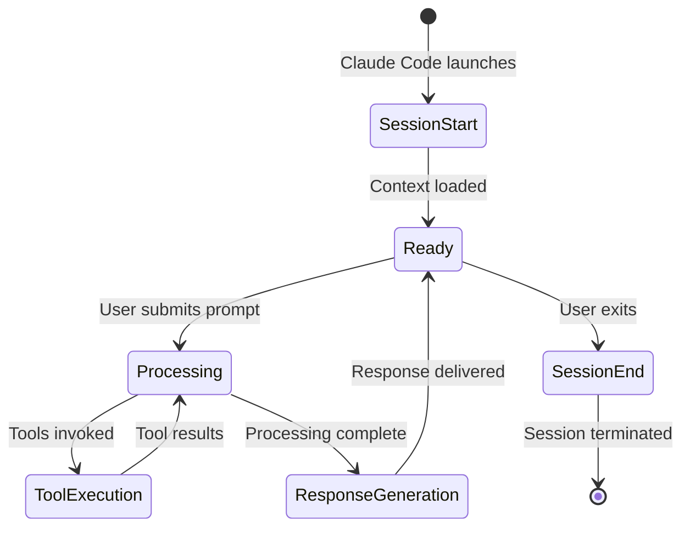
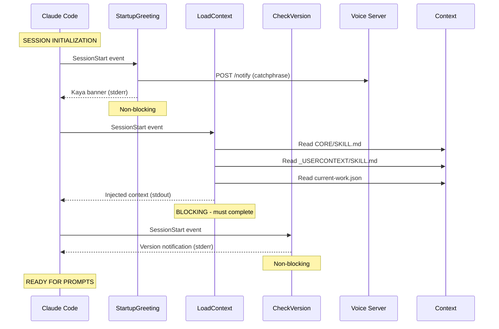
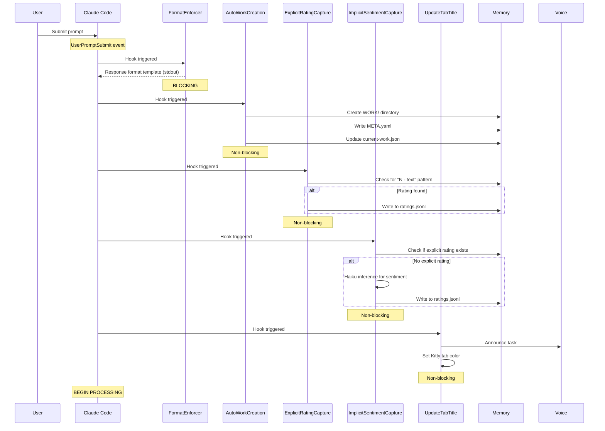
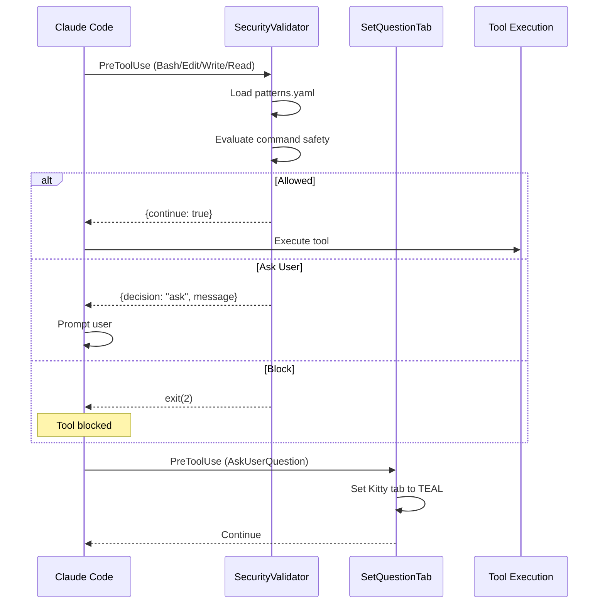
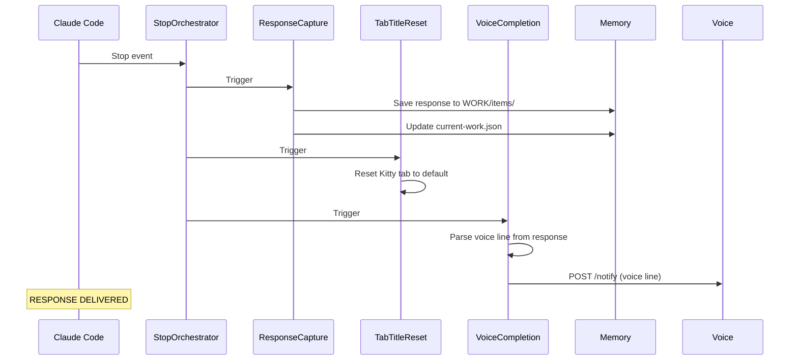
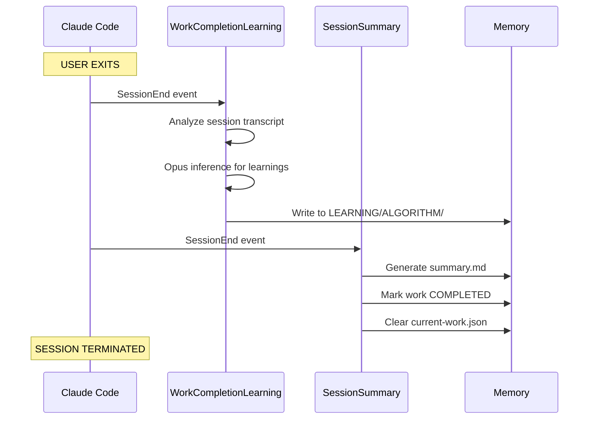

# SessionLifecycle Workflow

**Purpose:** Generate a detailed diagram of the Kaya session lifecycle showing all hook execution points and data flow.

---

## Quick Start

```bash
# Generate lifecycle diagram
bun ~/.claude/skills/Content/SystemFlowchart/Tools/DiagramBuilder.ts lifecycle

# Scan hooks for details
bun ~/.claude/skills/Content/SystemFlowchart/Tools/SystemScanner.ts hooks
```

---

## Workflow Steps

### Step 1: Scan Hooks

Use SystemScanner to get current hook configuration:

```bash
bun ~/.claude/skills/Content/SystemFlowchart/Tools/SystemScanner.ts hooks
```

Returns JSON with hook name, path, event type, and description.

### Step 2: Generate Lifecycle Diagram

Use DiagramBuilder to generate the sequence diagram:

```bash
bun ~/.claude/skills/Content/SystemFlowchart/Tools/DiagramBuilder.ts lifecycle
```

Output: `Output/markdown/session-lifecycle.md`

### Step 3: Generate PNG (Optional)

```bash
bun ~/.claude/skills/Content/SystemFlowchart/Tools/ArtBridge.ts generate \
  --title "Kaya Session Lifecycle" \
  --file Output/markdown/session-lifecycle.md \
  --output ~/Downloads/session-lifecycle.png
```

---

## Detailed Session Lifecycle Documentation

Create `~/.claude/skills/Content/SystemFlowchart/Output/SESSION_LIFECYCLE.md`:

```markdown
# Kaya Session Lifecycle

**Generated:** [TIMESTAMP]

This document details the complete lifecycle of a Kaya session from initialization to termination.

---

## Overview



---

## Detailed Hook Execution Flow

### SessionStart Phase (3 hooks)



### UserPromptSubmit Phase (5 hooks)



### PreToolUse Phase (per tool invocation)



### Stop Phase (response completion)



### SessionEnd Phase (session termination)



---

## Hook Configuration Reference

| Hook | Event | Type | Output |
|------|-------|------|--------|
| StartupGreeting | SessionStart | Non-blocking | stderr |
| LoadContext | SessionStart | **Blocking** | stdout |
| CheckVersion | SessionStart | Non-blocking | stderr |
| FormatEnforcer | UserPromptSubmit | **Blocking** | stdout |
| AutoWorkCreation | UserPromptSubmit | Non-blocking | files |
| ExplicitRatingCapture | UserPromptSubmit | Non-blocking | files |
| ImplicitSentimentCapture | UserPromptSubmit | Non-blocking | files |
| UpdateTabTitle | UserPromptSubmit | Non-blocking | Kitty/voice |
| SecurityValidator | PreToolUse | **Blocking** | decision |
| SetQuestionTab | PreToolUse | Non-blocking | Kitty |
| AgentOutputCapture | SubagentStop | Non-blocking | files |
| StopOrchestrator | Stop | Non-blocking | voice/files |
| WorkCompletionLearning | SessionEnd | Non-blocking | files |
| SessionSummary | SessionEnd | Non-blocking | files |

---

## State Files Used

| File | Purpose | Updated By |
|------|---------|-----------|
| `MEMORY/STATE/current-work.json` | Active work pointer | AutoWorkCreation, ResponseCapture, SessionSummary |
| `MEMORY/LEARNING/SIGNALS/ratings.jsonl` | User ratings | ExplicitRatingCapture, ImplicitSentimentCapture |
| `MEMORY/SECURITY/security-events.jsonl` | Security log | SecurityValidator |
| `MEMORY/WORK/*/items/response.md` | Claude responses | ResponseCapture |
| `MEMORY/WORK/*/summary.md` | Session summary | SessionSummary |
```

### Step 3: Save and Announce

```bash
mkdir -p ~/.claude/skills/Content/SystemFlowchart/Output
# Write document
open ~/.claude/skills/Content/SystemFlowchart/Output/SESSION_LIFECYCLE.md
```

Voice notification:
```bash
curl -s -X POST http://localhost:8888/notify \
  -H "Content-Type: application/json" \
  -d '{"message": "Session lifecycle diagram generated"}' \
  > /dev/null 2>&1 &
```
