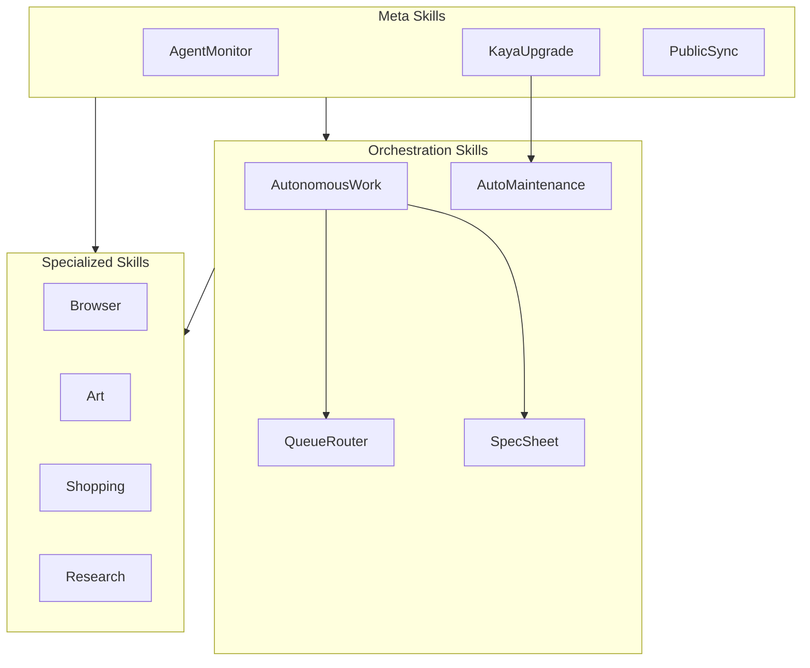

# SkillMap Workflow

**Purpose:** Generate a comprehensive diagram showing skill hierarchy, dependencies, and the new Meta/Orchestration/Specialized categorization.

---

## Overview

This workflow uses the new SkillCategorizer to organize skills into three categories:

| Category | Purpose | Examples |
|----------|---------|----------|
| **Meta** | Skills about skills/system | AgentMonitor, KayaUpgrade, PublicSync |
| **Orchestration** | Coordination engines | AutonomousWork, QueueRouter, AutoMaintenance |
| **Specialized** | Domain functionality | Browser, Art, Shopping, Gmail |

---

## Workflow Steps

### Step 1: Run Skill Categorization

```bash
# Full categorization with reasoning
bun ~/.claude/skills/Content/SystemFlowchart/Tools/SkillCategorizer.ts

# JSON output for programmatic use
bun ~/.claude/skills/Content/SystemFlowchart/Tools/SkillCategorizer.ts --json

# Mermaid diagram output
bun ~/.claude/skills/Content/SystemFlowchart/Tools/SkillCategorizer.ts --diagram
```

### Step 2: Generate Skill Ecosystem Diagram

Use DiagramBuilder to generate the categorized skill map:

```bash
bun ~/.claude/skills/Content/SystemFlowchart/Tools/DiagramBuilder.ts ecosystem
```

This generates a Mermaid flowchart with:
- Skills grouped by Meta/Orchestration/Specialized
- Color-coded by category
- Key dependency relationships shown

### Step 3: Scan for Additional Details

For detailed skill information:

```bash
bun ~/.claude/skills/Content/SystemFlowchart/Tools/SystemScanner.ts skills
```

Returns JSON with:
- Skill name and directory
- Description and USE WHEN triggers
- Workflows and tools count
- Dependencies on other skills
- Private vs public status

### Step 4: Save Output

The ecosystem diagram is saved to:
`Output/markdown/skill-ecosystem.md`

For PNG generation:
```bash
bun ~/.claude/skills/Content/SystemFlowchart/Tools/ArtBridge.ts generate \
  --title "Kaya Skill Ecosystem" \
  --subtitle "Meta / Orchestration / Specialized" \
  --file Output/markdown/skill-ecosystem.md \
  --output ~/Downloads/skill-ecosystem.png
```

---

## Category Definitions

### Meta Skills
Skills about skills and the system itself. Infrastructure, configuration, visualization.
Bucket = parent directory `System`.

| Skill | Purpose |
|-------|---------|
| AgentMonitor | Agent execution monitoring |
| KayaUpgrade | System improvements from content |
| PublicSync | Public repo sync |

### Orchestration Skills
Coordination and execution engines. Multi-agent, workflows, scheduling.
Bucket = parent directory `Automation` or `Agents`.

| Skill | Purpose |
|-------|---------|
| AutoInfoManager | Information intake triage |
| AutoMaintenance | Scheduled maintenance workflows |
| AutonomousWork | Universal execution engine |
| ProactiveEngine | Scheduled automation |
| QueueRouter | Task routing |
| SpecSheet | Spec-pipeline support (parent: Agents) |

### Specialized Skills
Domain-specific functionality. Everything else (57 skills).

Examples: Research, Browser, Art, Shopping, Cooking, Gmail, CalendarAssistant, etc.

---

## Diagram Output

The generated diagram includes:



---

## CLI Quick Reference

```bash
# Categorize all skills
bun SkillCategorizer.ts

# Generate ecosystem diagram
bun DiagramBuilder.ts ecosystem

# Full skill scan
bun SystemScanner.ts skills

# Generate PNG
bun ArtBridge.ts generate --diagram ecosystem --output ~/Downloads/skills.png
```

---

## Integration

### Uses
- `Tools/SkillCategorizer.ts` - Category assignment logic
- `Tools/SystemScanner.ts` - Skill metadata scanning
- `Tools/DiagramBuilder.ts` - Mermaid generation

### Feeds Into
- `GenerateArchitecture.md` - Master architecture document
- `USER/PAI_ARCHITECTURE.md` - Architecture reference
