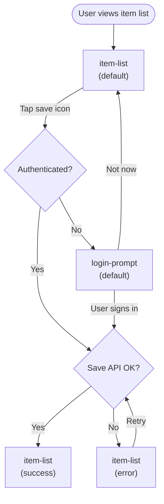

# Save Item — UX/UI Spec (Co-located canonical example)

**Effort:** Medium
**Surface:** browser
**Generated:** 2026-06-07

> This file is the canonical generator↔validator alignment example.
> It is the combined output of UXDesigner + UIDesigner in the co-located format.
> Run the validators against it to confirm format compliance.

## Overview

A user can save any item from the item list to their personal collection. The flow starts at
the item list, proceeds through a single-tap save action, and provides inline confirmation.
If the user is unauthenticated, a login prompt appears before the save completes.

## UX/UI Specification

> Generated by UXDesigner + UIDesigner (Sonnet). Surface: browser. Effort: Medium.

```yaml screen-inventory
screens:
  - id: item-list
    name: Item List
    purpose: Displays all available items and lets the user save items to their collection.
    route: /items
    entry:
      - App launch
      - Navigate back from login-prompt
    exits:
      - Open login-prompt when save is tapped while unauthenticated
    states:
      - default
      - loading
      - empty
      - error
      - success

  - id: login-prompt
    name: Login Prompt
    purpose: Inline modal prompting the user to authenticate before completing a save action.
    route: /items?auth=required
    entry:
      - Tap save icon on item-list while unauthenticated
    exits:
      - Return to item-list after successful login
      - Dismiss to return to item-list without saving
    states:
      - default
      - loading
      - error
```

### User Flows



## Screen: Item List (`item-list`)

**Purpose / Entry / Exits:** Displays all items; entered from app launch or back from login-prompt; exits to login-prompt when unauthenticated user taps save.

**Acceptance Criteria:**
- Given the user has opened the app, when the item list loads successfully, then at least one item is visible with a save icon in the unsaved state.
- Given the user has previously saved an item, when the item list loads, then that item's icon shows in the saved/active state.
- Given the user opens the item list, when the API request is in progress, then a loading skeleton is visible and save icons are not interactive.
- Given the user opens the item list, when the API returns zero items, then the empty-state message is displayed and no list container is rendered.
- Given the user opens the item list, when the API request fails with a network error, then an error message is shown with a Retry CTA and no list items are rendered.
- Given the user taps the save icon on an authenticated item, when the save API call succeeds, then a "Saved to your collection" toast is shown for 3 seconds and the icon updates to saved state.

### State: default

<!-- Spatial orientation: [PageHeader: h1 "Items"] / [ItemList: scrollable ul of ItemCards] -->

```html
<main class="mx-auto max-w-2xl px-4 sm:px-6 py-8 space-y-6">

  <!-- Page header -->
  <header>
    <!-- h1 landmark heading for this route -->
    <h1 class="text-2xl font-bold text-foreground">Items</h1>
  </header>

  <!-- Item list: ul of ItemCard molecules -->
  <ul class="space-y-3" aria-label="Available items">

    <!-- ItemCard molecule (repeat for each item) -->
    <!-- <Card> -->
    <li class="rounded-lg border border-border bg-card p-4
               flex items-center justify-between gap-4 shadow-sm">

      <!-- Item info block -->
      <div class="space-y-1 min-w-0">
        <!-- Item name: text-sm font-medium text-foreground -->
        <p class="text-sm font-medium text-foreground truncate">[Item Name — typical: 1–4 words]</p>
        <!-- <Badge variant="secondary"> -->
        <span class="inline-flex items-center rounded-full bg-secondary
                     px-2.5 py-0.5 text-xs font-medium text-secondary-foreground">
          [Category — e.g. "Electronics"]
        </span>
      </div>

      <!-- Save icon button -->
      <!-- <Button variant="ghost" size="icon" aria-label="Save [Item Name]"> -->
      <!-- Touch target: min-h-[44px] min-w-[44px] — WCAG 2.2 2.5.8 -->
      <button
        class="rounded-md hover:bg-accent min-h-[44px] min-w-[44px]
               flex items-center justify-center flex-shrink-0
               focus-visible:ring-2 focus-visible:ring-ring focus-visible:ring-offset-2"
        aria-label="Save [Item Name]"
        type="button"
      >
        <!-- [CUSTOM: BookmarkIcon — outline variant (item not yet saved)] -->
        <!-- aria-hidden="true" — label is on the button -->
        <span aria-hidden="true" class="h-4 w-4 text-muted-foreground">[BookmarkIcon — outline]</span>
      </button>

    </li>
    <!-- /ItemCard — repeat for each item in list -->

  </ul>

</main>
```

**A11y notes (default):**
- `<h1>` is the route's landmark heading; no other `h1` on `/items`.
- Focus order: `h1` → first save button → subsequent save buttons (DOM order, top-to-bottom).
- Save button: `aria-label="Save [Item Name]"` required — icon-only button (WCAG 4.1.2 Name, Role, Value).
- Touch target: `min-h-[44px] min-w-[44px]` on every save button — exceeds WCAG 2.2 2.5.8 minimum.
- Previously saved items: `aria-label="[Item Name] saved"` + BookmarkIcon filled variant.

### State: loading

<!-- Visual diff from default: ul replaced with 5 Skeleton cards; aria-busy on section; sr-only live region -->

```html
<main class="mx-auto max-w-2xl px-4 sm:px-6 py-8 space-y-6">

  <header>
    <h1 class="text-2xl font-bold text-foreground">Items</h1>
  </header>

  <!-- Loading skeleton section -->
  <section aria-busy="true" aria-label="Loading items" class="space-y-3">

    <!-- 5× skeleton ItemCard placeholders -->
    <!-- <Skeleton> — aria-hidden="true" — decorative -->
    <div aria-hidden="true"
         class="rounded-lg border border-border bg-card p-4
                flex items-center justify-between gap-4 shadow-sm">
      <div class="space-y-2">
        <!-- <Skeleton className="h-4 w-40"> -->
        <div class="h-4 w-40 rounded bg-muted animate-pulse"></div>
        <!-- <Skeleton className="h-3 w-20 rounded-full"> -->
        <div class="h-3 w-20 rounded-full bg-muted animate-pulse"></div>
      </div>
      <!-- <Skeleton className="h-9 w-9 rounded-md"> -->
      <div class="h-9 w-9 rounded-md bg-muted animate-pulse flex-shrink-0"></div>
    </div>
    <!-- repeat 4 more times -->

  </section>

  <!-- Screen-reader-only loading announcement -->
  <div class="sr-only" role="status" aria-live="polite">Loading items…</div>

</main>
```

**A11y notes (loading):**
- `aria-busy="true"` on the skeleton container announces the region is updating.
- All skeleton divs: `aria-hidden="true"` — decorative placeholders.
- `role="status" aria-live="polite"` sr-only div announces loading state to screen readers politely.
- No interactive elements rendered during loading — skeletons replace ItemCards entirely.

### State: empty

<!-- Visual diff from default: no ul; EmptyState molecule in place of list; no CTA -->

```html
<main class="mx-auto max-w-2xl px-4 sm:px-6 py-8 space-y-6">

  <header>
    <h1 class="text-2xl font-bold text-foreground">Items</h1>
  </header>

  <!-- EmptyState molecule — no list rendered -->
  <div class="flex flex-col items-center justify-center py-16 text-center space-y-3">
    <!-- Decorative empty-state icon -->
    <!-- aria-hidden="true" — decorative -->
    <span aria-hidden="true" class="text-muted-foreground h-12 w-12">[EmptyBoxIcon]</span>
    <!-- Empty heading: h2 under h1 landmark -->
    <h2 class="text-lg font-semibold text-foreground">Nothing here yet</h2>
    <p class="text-sm text-muted-foreground max-w-xs leading-normal">
      Check back later — new items are added regularly.
    </p>
    <!-- No primary CTA: no creation action from this screen per UX spec -->
  </div>

</main>
```

**A11y notes (empty):**
- Heading hierarchy: `h1` (page) → `h2` (empty-state heading). No skipped levels.
- Empty state icon: `aria-hidden="true"` — purely decorative.
- No interactive elements in this state — no CTA per UX spec decision.

### State: error

<!-- Visual diff from default: ErrorBanner replaces list content; Retry button is primary action -->

```html
<main class="mx-auto max-w-2xl px-4 sm:px-6 py-8 space-y-4">

  <header>
    <h1 class="text-2xl font-bold text-foreground">Items</h1>
  </header>

  <!-- ErrorBanner molecule -->
  <!-- <Alert variant="destructive" role="alert" aria-live="assertive"> -->
  <div class="rounded-lg border border-destructive bg-destructive/10 p-4 space-y-2"
       role="alert" aria-live="assertive">

    <!-- Alert icon (decorative) -->
    <!-- <AlertCircleIcon aria-hidden="true" class="h-4 w-4 text-destructive"> -->
    <span aria-hidden="true" class="inline-block h-4 w-4 text-destructive">[AlertCircleIcon]</span>

    <!-- Error heading: h2 under h1 landmark -->
    <h2 class="text-sm font-semibold text-destructive">Couldn't load items</h2>
    <p class="text-sm text-destructive">Check your connection and try again.</p>

    <!-- Retry CTA -->
    <!-- <Button variant="outline" size="sm"> -->
    <button
      class="mt-2 rounded-md border border-border bg-background px-4 py-2
             text-sm font-medium text-foreground hover:bg-accent
             min-h-[44px]
             focus-visible:ring-2 focus-visible:ring-ring focus-visible:ring-offset-2"
      type="button"
    >
      Retry
    </button>

  </div>

</main>
```

**A11y notes (error):**
- `role="alert" aria-live="assertive"` — error announced immediately to screen readers.
- Alert icon: `aria-hidden="true"` — label is in the adjacent `<h2>`.
- Retry button: `min-h-[44px]`, clear label "Retry", focus ring.
- No list content rendered — error banner replaces the list, does not overlay it.

### State: success

<!-- Visual diff from default: list identical to default; saved item icon = filled variant; SaveConfirmToast overlays bottom-right -->

```html
<!-- SaveConfirmToast — rendered in toast portal (fixed, above all content) -->
<!-- <Toast role="status" aria-live="polite"> — Sonner -->
<div class="fixed bottom-4 right-4 z-50 max-w-sm
            rounded-lg border border-border bg-card px-4 py-3 shadow-lg
            flex items-center gap-3"
     role="status" aria-live="polite">
  <!-- <CheckCircleIcon aria-hidden="true" class="h-4 w-4 text-foreground"> -->
  <span aria-hidden="true" class="h-4 w-4 text-foreground flex-shrink-0">[CheckCircleIcon]</span>
  <p class="text-sm font-medium text-foreground">Saved to your collection</p>
</div>

<!-- Main list: identical to default state; saved item's button updated: -->
<ul class="space-y-3" aria-label="Available items">
  <!-- Saved item's card — save button updated to saved state -->
  <li class="rounded-lg border border-border bg-card p-4
             flex items-center justify-between gap-4 shadow-sm">
    <div class="space-y-1 min-w-0">
      <p class="text-sm font-medium text-foreground truncate">[Item Name — the just-saved item]</p>
      <span class="inline-flex items-center rounded-full bg-secondary
                   px-2.5 py-0.5 text-xs font-medium text-secondary-foreground">
        [Category]
      </span>
    </div>
    <!-- <Button variant="ghost" size="icon" aria-label="[Item Name] saved"> -->
    <button
      class="rounded-md hover:bg-accent min-h-[44px] min-w-[44px]
             flex items-center justify-center flex-shrink-0
             focus-visible:ring-2 focus-visible:ring-ring focus-visible:ring-offset-2"
      aria-label="[Item Name] saved"
      type="button"
    >
      <!-- [CUSTOM: BookmarkIcon — filled/active variant (item is saved)] -->
      <span aria-hidden="true" class="h-4 w-4 text-primary">[BookmarkIcon — filled]</span>
    </button>
  </li>
</ul>
```

**A11y notes (success):**
- `role="status" aria-live="polite"` on toast — announced politely without interrupting speech.
- Focus stays on the save button that triggered the action — does NOT move to the toast.
- Save button `aria-label` updates to `"[Item Name] saved"` — screen reader detects the value change (WCAG 4.1.2).
- Toast auto-dismisses after 3 seconds.

### Component Inventory

| Component | Tier | shadcn Ref | Notes |
|-----------|------|------------|-------|
| `Button (save)` | Atom | `shadcn/button` | `variant="ghost" size="icon"`; `aria-label` required |
| `Badge (category)` | Atom | `shadcn/badge` | `variant="secondary"` |
| `Skeleton (card)` | Atom | `shadcn/skeleton` | `h-16 w-full rounded-lg`; `aria-hidden="true"` |
| `Alert (error)` | Atom | `shadcn/alert` | `variant="destructive"`; `role="alert" aria-live="assertive"` |
| `Button (retry)` | Atom | `shadcn/button` | `variant="outline" size="sm"` |
| `Toast` | Atom | `shadcn/sonner` | `role="status" aria-live="polite"`; 3s auto-dismiss |
| `ItemCard` | Molecule | — | `[CUSTOM]` — Card + Badge + Button(save) |
| `EmptyState` | Molecule | — | optional icon + `h2` + body `p` |
| `ErrorBanner` | Molecule | `shadcn/alert` | Alert + Button(retry) |
| `BookmarkIcon` | Atom | — | `[CUSTOM]` — outline = unsaved; filled = saved; `aria-hidden="true"` on icon |

### Accessibility (WCAG 2.2 AA)

- Focus order: `h1` → list items top-to-bottom → each item's save button.
- ARIA: `aria-label` on every icon-only button; `role="alert"` on ErrorBanner; `role="status"` on Toast; `aria-live="polite"` on loading announcement.
- Contrast: 4.5:1 text on `bg-card`; 3:1 for UI components (`border-border`, icon fill). All semantic token pairs are validated in the token system.
- Touch targets: `min-h-[44px] min-w-[44px]` on save button — meets WCAG 2.2 2.5.8.
- Focus ring: `focus-visible:ring-2 focus-visible:ring-ring focus-visible:ring-offset-2` meets WCAG 2.4.13.

## Screen: Login Prompt (`login-prompt`)

**Purpose / Entry / Exits:** Inline modal to authenticate before saving; entered when unauthenticated user taps save on item-list; exits by signing in (returns to item-list) or dismissing (returns without saving).

**Acceptance Criteria:**
- Given the user is unauthenticated and taps a save icon, when the login prompt appears, then the heading, email field, password field, "Sign in" CTA, and "Not now" link are all visible.
- Given the login prompt is open, when the user taps "Not now", then the modal closes and the user is returned to item-list default state without saving.
- Given the user has entered credentials and tapped "Sign in", when the auth request is in progress, then the "Sign in" button is disabled and shows "Signing in…".
- Given the user has entered invalid credentials and tapped "Sign in", when the auth request fails with a 401, then an inline error message appears below the password field and the form remains open.

### State: default

<!-- Spatial orientation: [Modal overlay on item-list] / [Dialog: heading + subheading + email + password + Sign in + Not now] -->

```html
<!-- Dialog overlay (backdrop) -->
<div class="fixed inset-0 z-50 bg-background/80 backdrop-blur-sm"
     aria-hidden="true"></div>

<!-- Login dialog -->
<!-- <Dialog role="dialog" aria-labelledby="login-title" aria-modal="true"> -->
<div class="fixed inset-0 z-50 flex items-center justify-center p-4">
  <div class="w-full max-w-md rounded-lg border border-border bg-card p-6 shadow-lg space-y-4"
       role="dialog"
       aria-modal="true"
       aria-labelledby="login-title">

    <!-- Dialog header -->
    <div class="space-y-1">
      <!-- DialogTitle — required for screen readers -->
      <h2 class="text-xl font-semibold text-foreground" id="login-title">
        Sign in to save items
      </h2>
      <p class="text-sm text-muted-foreground">
        Create a free account or sign in to keep your saved items.
      </p>
    </div>

    <!-- Login form -->
    <form class="space-y-4" novalidate>

      <!-- EmailFormField molecule -->
      <div class="space-y-2">
        <!-- <Label htmlFor="login-email"> -->
        <label class="text-sm font-medium text-foreground" for="login-email">
          Email address
        </label>
        <!-- <Input type="email" id="login-email" aria-required="true"> -->
        <input
          class="w-full rounded-md border border-input bg-background px-3 py-2
                 text-sm text-foreground placeholder:text-muted-foreground
                 focus-visible:ring-2 focus-visible:ring-ring focus-visible:ring-offset-2
                 min-h-[44px]"
          type="email"
          id="login-email"
          name="email"
          placeholder="[Email placeholder — e.g. you@example.com]"
          aria-required="true"
          autocomplete="email"
        />
      </div>

      <!-- PasswordFormField molecule -->
      <div class="space-y-2">
        <!-- <Label htmlFor="login-password"> -->
        <label class="text-sm font-medium text-foreground" for="login-password">
          Password
        </label>
        <!-- <Input type="password" id="login-password" aria-required="true"> -->
        <input
          class="w-full rounded-md border border-input bg-background px-3 py-2
                 text-sm text-foreground
                 focus-visible:ring-2 focus-visible:ring-ring focus-visible:ring-offset-2
                 min-h-[44px]"
          type="password"
          id="login-password"
          name="password"
          aria-required="true"
          autocomplete="current-password"
        />
      </div>

      <!-- Sign in button: <Button variant="default" type="submit" class="w-full"> -->
      <button
        class="w-full rounded-md bg-primary px-4 py-2 text-sm font-medium
               text-primary-foreground hover:bg-primary/90
               min-h-[44px]
               focus-visible:ring-2 focus-visible:ring-ring focus-visible:ring-offset-2"
        type="submit"
      >
        Sign in
      </button>

      <!-- Not now: <Button variant="ghost" type="button" class="w-full"> -->
      <button
        class="w-full rounded-md px-4 py-2 text-sm font-medium
               text-muted-foreground hover:bg-accent hover:text-accent-foreground
               min-h-[44px]
               focus-visible:ring-2 focus-visible:ring-ring focus-visible:ring-offset-2"
        type="button"
      >
        Not now
      </button>

    </form>

  </div>
</div>
```

**A11y notes (default):**
- Dialog: `role="dialog" aria-modal="true" aria-labelledby="login-title"` — screen reader announces dialog + title on open.
- Focus trap: Tab/Shift+Tab cycles only within the dialog while open.
- Focus on open: moves to the email input (first focusable element).
- Both inputs: `aria-required="true"`, `autocomplete` attributes per WCAG 1.3.5.
- Backdrop: `aria-hidden="true"` — decorative.

### State: loading

<!-- Visual diff from default: Sign in button disabled + shows "Signing in…" with spinner; form locked -->

```html
<!-- Dialog structure identical to default; only the Sign in button changes -->

<!-- ... (same dialog wrapper, header, form fields as default) ... -->

      <!-- Sign in button — loading state -->
      <!-- <Button variant="default" type="submit" disabled aria-busy="true" class="w-full"> -->
      <button
        class="w-full rounded-md bg-primary px-4 py-2 text-sm font-medium
               text-primary-foreground opacity-70 cursor-not-allowed
               min-h-[44px]
               focus-visible:ring-2 focus-visible:ring-ring focus-visible:ring-offset-2"
        type="submit"
        disabled
        aria-busy="true"
      >
        <span class="flex items-center justify-center gap-2">
          <!-- [CUSTOM: Spinner — 16px animated spinner, text-primary-foreground] -->
          <!-- aria-hidden="true" on spinner -->
          <span aria-hidden="true" class="h-4 w-4 animate-spin">[SpinnerIcon]</span>
          Signing in…
        </span>
      </button>

<!-- Screen-reader announcement for loading state -->
<div class="sr-only" role="status" aria-live="polite">Signing in…</div>
```

**A11y notes (loading):**
- Sign in button: `disabled` + `aria-busy="true"` — announces button as busy.
- `role="status" aria-live="polite"` sr-only div: announces "Signing in…" politely.
- Spinner: `aria-hidden="true"` — decorative; label on button provides accessible name.
- Not now button remains enabled during loading.

### State: error

<!-- Visual diff from default: InlineError below password field; password input gets error border + aria-invalid; Sign in button re-enabled -->

```html
<!-- Dialog structure identical to default; changes: password field error state + inline error -->

<!-- ... (same dialog wrapper and email field as default) ... -->

      <!-- PasswordFormField molecule — error state -->
      <div class="space-y-2">
        <label class="text-sm font-medium text-foreground" for="login-password">
          Password
        </label>
        <!-- Input with error: border-destructive + aria-invalid + aria-describedby -->
        <input
          class="w-full rounded-md border border-destructive bg-background px-3 py-2
                 text-sm text-foreground
                 focus-visible:ring-2 focus-visible:ring-ring focus-visible:ring-offset-2
                 min-h-[44px]"
          type="password"
          id="login-password"
          name="password"
          aria-required="true"
          aria-invalid="true"
          aria-describedby="login-password-error"
          autocomplete="current-password"
        />
        <!-- InlineError: <p role="alert" aria-live="assertive"> [CUSTOM] -->
        <p
          class="text-sm text-destructive"
          id="login-password-error"
          role="alert"
          aria-live="assertive"
        >
          Email or password is incorrect. Try again.
        </p>
      </div>

      <!-- Sign in button re-enabled (same as default) -->
      <button
        class="w-full rounded-md bg-primary px-4 py-2 text-sm font-medium
               text-primary-foreground hover:bg-primary/90
               min-h-[44px]
               focus-visible:ring-2 focus-visible:ring-ring focus-visible:ring-offset-2"
        type="submit"
      >
        Sign in
      </button>
```

**A11y notes (error):**
- Password input: `aria-invalid="true"` — announces field as invalid (WCAG 3.3.1, 4.1.2).
- `aria-describedby="login-password-error"` — links input to error message.
- InlineError: `role="alert" aria-live="assertive"` — announced immediately on appearance.
- Error is not color-only: text "Email or password is incorrect. Try again." is provided (WCAG 1.4.1).
- Sign in button: re-enabled (same as default).

### Component Inventory

| Component | Tier | shadcn Ref | Notes |
|-----------|------|------------|-------|
| `Input (email)` | Atom | `shadcn/input` | `type="email"`; `aria-required="true"` |
| `Input (password)` | Atom | `shadcn/input` | `type="password"`; `aria-required="true"` |
| `Label (email)` | Atom | `shadcn/label` | `htmlFor="login-email"` |
| `Label (password)` | Atom | `shadcn/label` | `htmlFor="login-password"` |
| `Button (sign-in)` | Atom | `shadcn/button` | `variant="default"`; full-width; loading: `disabled aria-busy="true"` |
| `Button (not-now)` | Atom | `shadcn/button` | `variant="ghost"`; full-width |
| `InlineError` | Atom | — | `[CUSTOM]` — `<p role="alert" aria-live="assertive">` |
| `Spinner` | Atom | — | `[CUSTOM]` — animated spinner inside Sign-in button |
| `EmailFormField` | Molecule | — | Label(email) + Input(email) |
| `PasswordFormField` | Molecule | — | Label(password) + Input(password) + InlineError (error state only) |
| `LoginDialog` | Organism | `shadcn/dialog` | `role="dialog" aria-labelledby="login-title" aria-modal="true"`; focus trap; Escape closes |

### Accessibility (WCAG 2.2 AA)

- Focus trap: Tab/Shift+Tab cycles within the dialog while open; Escape closes and returns focus to the triggering save button.
- ARIA: `role="dialog"` + `aria-modal="true"` + `aria-labelledby="login-title"` on the dialog container; `aria-required="true"` on both inputs; `aria-invalid="true"` + `aria-describedby` on password input in error state; `role="alert"` on InlineError.
- Contrast: 4.5:1 for `text-foreground` on `bg-card`; 4.5:1 for `text-primary-foreground` on `bg-primary`; 3:1 for `border-input` on `bg-background`.
- Touch targets: `min-h-[44px]` on all interactive elements — meets WCAG 2.2 2.5.8.
- Focus ring: `focus-visible:ring-2 focus-visible:ring-ring focus-visible:ring-offset-2` on all interactive elements — meets WCAG 2.4.13.
