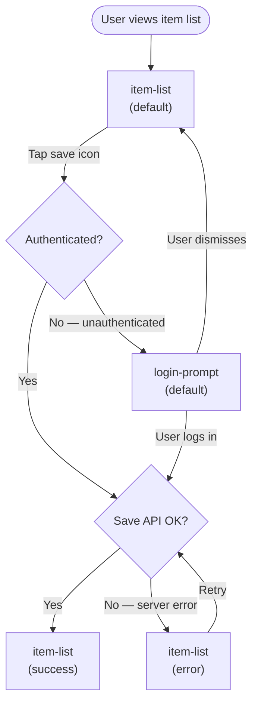

# Save Item — UX Spec (UXDesigner output stage)

**Effort:** Medium
**Surface:** browser
**Generated:** 2026-06-07

> This file shows UXDesigner output — the co-located `## Screen:` sections contain
> Purpose, Acceptance Criteria, and state stubs only. The UIDesigner fills in the
> wireframes, Component Inventory, and Accessibility sections in the same sections.
>
> For the complete combined UX + UI example, see:
> `skills/Development/UISpec/Templates/example-uxui-spec.md`

## Overview

A user can save any item from the item list to their personal collection. The flow begins at
the item list screen, proceeds through a single-tap save action, and provides inline
confirmation. If the user is unauthenticated, they are redirected to a login prompt before
the save completes.

## UX/UI Specification

> Generated by UXDesigner (Sonnet). Surface: browser. Effort: Medium.
> UIDesigner will add wireframes, component inventory, and accessibility notes into each
> `## Screen:` section below.

```yaml screen-inventory
screens:
  - id: item-list
    name: Item List
    purpose: Displays all available items and lets the user save items to their collection.
    route: /items
    entry:
      - App launch
      - Navigate back from login-prompt
    exits:
      - Open login-prompt when save is tapped while unauthenticated
    states:
      - default
      - loading
      - empty
      - error
      - success

  - id: login-prompt
    name: Login Prompt
    purpose: Inline modal prompting the user to authenticate before completing a save action.
    route: /items?auth=required
    entry:
      - Tap save icon on item-list while unauthenticated
    exits:
      - Return to item-list after successful login
      - Dismiss to return to item-list without saving
    states:
      - default
      - loading
      - error
```

### User Flows



## Screen: Item List (`item-list`)

**Purpose / Entry / Exits:** Displays all available items; entered from app launch or navigating back from login-prompt; exits to login-prompt when unauthenticated user taps save.

**Acceptance Criteria:**
- Given the user has opened the app, when the item list loads successfully, then at least one item is visible, each with a save icon in the unsaved state.
- Given the user has previously saved an item, when the item list loads, then the saved item's icon is shown in the saved/active state.
- Given the user opens the item list, when the API request is in progress, then a loading skeleton or spinner is shown and save icons are not interactive.
- Given the user opens the item list, when the API returns zero items, then the empty-state message is displayed and no list container is rendered.
- Given the user opens the item list, when the API request fails with a network error, then the error message is shown with a Retry CTA and no list items are rendered.
- Given the user taps Retry, when the subsequent API request succeeds, then the item list transitions to the default state.
- Given the user taps the save icon on an authenticated item, when the save API call succeeds, then a "Saved to your collection" toast is shown for 3 seconds and the save icon updates to its saved state.

<!-- UIDesigner: insert ### State: wireframes below. One per state in the inventory above. -->

### State: default

**Microcopy:**
- Heading: "Items"
- Save icon label (accessible): "Save [item name]"
- Saved icon label (accessible): "[item name] saved"

### State: loading

**Microcopy:**
- Accessible loading label: "Loading items…"
- _(No primary CTA while loading; save icons are not interactive)_

### State: empty

**Microcopy:**
- Heading: "Nothing here yet"
- Body: "Check back later — new items are added regularly."
- Primary CTA: _(none — no creation action from this screen)_

### State: error

**Microcopy:**
- Heading: "Couldn't load items"
- Body: "Check your connection and try again."
- Primary CTA: "Retry"

**Error Sub-cases:**

| Sub-case | Heading | Body | CTA |
|----------|---------|------|-----|
| Network unavailable | "No internet connection" | "Connect to Wi-Fi or mobile data to continue." | Retry |
| Server error (5xx) | "Something went wrong" | "We're working on it — try again in a moment." | Retry |

### State: success

**Microcopy:**
- Toast/confirmation message: "Saved to your collection"
- Duration: 3 seconds, then auto-dismiss

<!-- UIDesigner: add ### Component Inventory and ### Accessibility (WCAG 2.2 AA) after the last state. -->

## Screen: Login Prompt (`login-prompt`)

**Purpose / Entry / Exits:** Inline modal to authenticate before saving; entered when unauthenticated user taps save on item-list; exits by signing in (returns to item-list) or dismissing (returns without saving).

**Acceptance Criteria:**
- Given the user is unauthenticated and taps a save icon, when the login prompt appears, then the heading, email field, password field, "Sign in" CTA, and "Not now" link are all visible.
- Given the login prompt is open, when the user taps "Not now", then the modal closes and the user is returned to the item-list default state without saving.
- Given the user has entered credentials and tapped "Sign in", when the auth request is in progress, then the "Sign in" button is disabled and shows "Signing in…".
- Given the user has entered invalid credentials and tapped "Sign in", when the auth request fails with a 401, then an inline error message appears below the password field and the form remains open and editable.

<!-- UIDesigner: insert ### State: wireframes below. One per state in the inventory above. -->

### State: default

**Microcopy:**
- Heading: "Sign in to save items"
- Subheading: "Create a free account or sign in to keep your saved items."
- Primary CTA: "Sign in"
- Secondary CTA: "Not now"
- Email field label: "Email address"
- Password field label: "Password"

### State: loading

**Microcopy:**
- Accessible loading label: "Signing in…"
- "Sign in" button label changes to "Signing in…" and is disabled

### State: error

**Microcopy:**
- Inline error (below password field): "Email or password is incorrect. Try again."
- Primary CTA: "Sign in" (re-enabled)

<!-- UIDesigner: add ### Component Inventory and ### Accessibility (WCAG 2.2 AA) after the last state. -->
