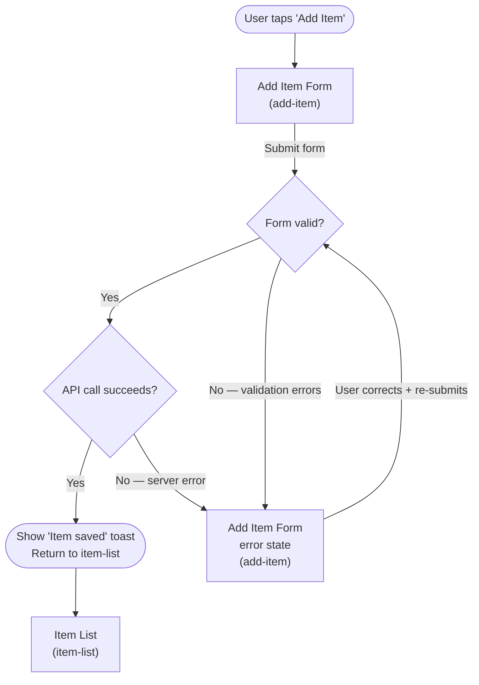

# User Flow — Mermaid Guidance

User Flows in a UX Spec are **Mermaid `flowchart TD`** diagrams. Each flow covers one primary task path through the feature — with error paths and branch decisions, not just the happy path.

## Syntax Rules

- **Use `flowchart TD`** — top-down. Never `graph TD` or `graph LR` (inconsistent rendering in some environments).
- **Screen nodes**: Use the screen's `id` from the Screen Inventory as the node identifier. Label it with the screen `name`.
  ```mermaid
  flowchart TD
    home["Home Screen"]
    detail["Detail Screen"]
  ```
- **Decision nodes**: Use diamond shape `{...}` with the condition stated as a question.
  ```mermaid
    home -->|Tap item| authCheck{Auth token valid?}
  ```
- **Transitions**: Label every arrow with the user action or system event that triggers it. Keep labels short (3–6 words).
- **Terminal nodes**: Use rounded rectangles `([...])` for entry/exit terminals.
  ```mermaid
    ([App Launch]) --> home
    detail --> ([Back to Home])
  ```
- **Error paths**: Always include failure branches from decision nodes. Use a red-ish annotation convention in comments or labels (e.g., `|Error: network fail|`).

## What Must Be In Every Flow

1. An entry terminal (the trigger that starts the task).
2. At least one decision node (auth check, data availability, validation, permission, etc.).
3. The happy path to a success terminal.
4. At least one error branch with its resolution (retry, fallback, or dead-end).
5. References only to screens declared in the Screen Inventory — no orphan screens.

## Complete Example



## Scope by Effort Tier

| Tier | Flows to include |
|------|-----------------|
| **Small** | One flow covering the touched screens only |
| **Medium** | One flow per major task path (typically 2–4 flows) |
| **Large** | All task paths + edge/exception flows + persona-variant flows where behavior differs |

## Common Mistakes to Avoid

- **Happy-path-only flows.** Flows without error branches are incomplete and will fail SpecValidator coverage checks.
- **Orphan screens in flows.** Every node must match a `screens[].id` in the Screen Inventory.
- **Decision nodes without labels.** Unlabeled decisions are ambiguous — always state the condition.
- **Overly wide flows.** If a flow has more than ~15 nodes, split it into multiple named flows (one per task).
