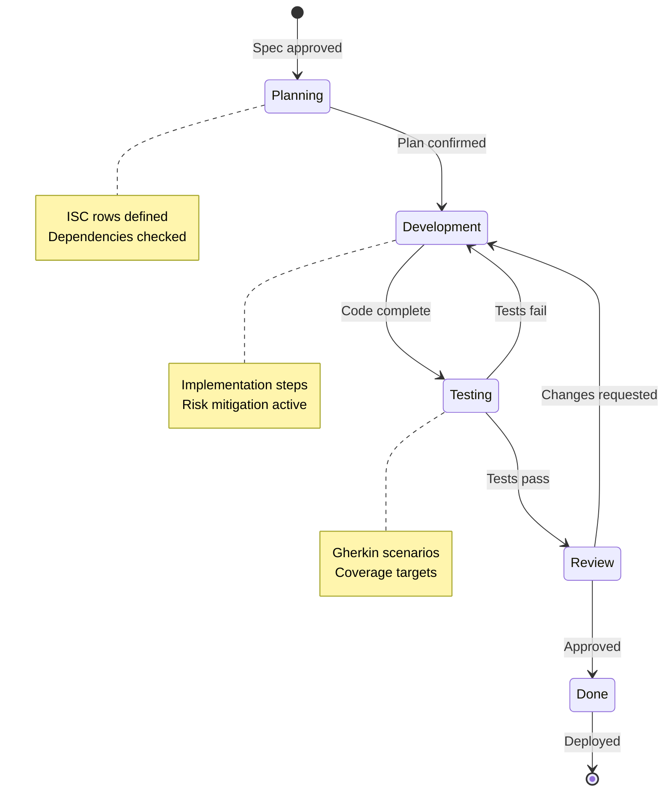

# {{WORK_NAME}} - Current Work Specification

> **Version:** 1.0.0
> **Status:** Implementation-Ready
> **Owner:** {{OWNER}}
> **Created:** {{DATE}}
> **Grounded Ideal:** {{LINK_TO_GROUNDED_IDEAL}}
> **Milestone:** {{MILESTONE_NUMBER}}

---

## 1. Summary

### 1.1 What We're Building

{{SUMMARY_DESCRIPTION}}

### 1.2 Grounded Ideal Alignment

**Target from Grounded Ideal:** {{SPECIFIC_TARGET}}

**How This Work Contributes:**
- Implements: {{WHAT_THIS_IMPLEMENTS}}
- Enables: {{WHAT_THIS_ENABLES}}
- Advances: {{HOW_IT_ADVANCES_TOWARD_IDEAL}}

### 1.3 Success Definition

**This work is complete when:**
- [ ] {{SUCCESS_CRITERION_1}}
- [ ] {{SUCCESS_CRITERION_2}}
- [ ] {{SUCCESS_CRITERION_3}}

---

## 2. Current → Target State

### 2.1 Current State Analysis

**What Exists Today:**
{{CURRENT_STATE_DESCRIPTION}}

**Current Limitations:**
| Limitation | Impact | Addressed By This Work? |
|------------|--------|-------------------------|
| {{LIMITATION_1}} | {{IMPACT}} | ✅ Yes / ❌ No |
| {{LIMITATION_2}} | {{IMPACT}} | ✅ Yes / ❌ No |
| {{LIMITATION_3}} | {{IMPACT}} | ✅ Yes / ❌ No |

**Current Metrics (Baseline):**
| Metric | Current Value | Source |
|--------|---------------|--------|
| {{METRIC_1}} | {{VALUE}} | {{SOURCE}} |
| {{METRIC_2}} | {{VALUE}} | {{SOURCE}} |

### 2.2 Target State (After This Work)

**What Will Exist:**
{{TARGET_STATE_DESCRIPTION}}

**Improvements Delivered:**
| Improvement | Before | After | Delta |
|-------------|--------|-------|-------|
| {{IMPROVEMENT_1}} | {{BEFORE}} | {{AFTER}} | {{DELTA}} |
| {{IMPROVEMENT_2}} | {{BEFORE}} | {{AFTER}} | {{DELTA}} |
| {{IMPROVEMENT_3}} | {{BEFORE}} | {{AFTER}} | {{DELTA}} |

### 2.3 Remaining Gap to Grounded Ideal

**After this work, what remains?**

| Grounded Ideal Feature | Status After This Work | Remaining Work |
|------------------------|------------------------|----------------|
| {{FEATURE_1}} | {{COMPLETE|PARTIAL|NOT_STARTED}} | {{REMAINING}} |
| {{FEATURE_2}} | {{STATUS}} | {{REMAINING}} |
| {{FEATURE_3}} | {{STATUS}} | {{REMAINING}} |

**Percentage Complete Toward Grounded Ideal:** {{PERCENTAGE}}%

---

## 3. Scope Definition

### 3.1 In Scope

- {{IN_SCOPE_1}}
- {{IN_SCOPE_2}}
- {{IN_SCOPE_3}}
- {{IN_SCOPE_4}}

### 3.2 Out of Scope

| Item | Why Out of Scope | Future Work? |
|------|------------------|--------------|
| {{OUT_OF_SCOPE_1}} | {{REASON}} | {{YES_NO}} |
| {{OUT_OF_SCOPE_2}} | {{REASON}} | {{YES_NO}} |
| {{OUT_OF_SCOPE_3}} | {{REASON}} | {{YES_NO}} |

### 3.3 Dependencies

**Blocking Dependencies (must exist before this work):**
| Dependency | Status | Owner |
|------------|--------|-------|
| {{DEPENDENCY_1}} | {{READY|PENDING|BLOCKED}} | {{OWNER}} |
| {{DEPENDENCY_2}} | {{STATUS}} | {{OWNER}} |

**Non-Blocking Dependencies (nice to have):**
| Dependency | Impact if Missing | Workaround |
|------------|-------------------|------------|
| {{DEPENDENCY_3}} | {{IMPACT}} | {{WORKAROUND}} |

### 3.5 User Stories (From Grounded Ideal)

| ID | Story | Priority | Phase |
|----|-------|----------|-------|
| US-001 | {{STORY_1}} | P1 | Phase 1 |
| US-002 | {{STORY_2}} | P2 | Phase 2 |
| US-003 | {{STORY_3}} | P3 | Phase 3 |

---

## 4. Ideal State Criteria (ISC)

> *These criteria feed directly into THEALGORITHM for execution*

| # | What Ideal Looks Like | Source | Verify Method |
|---|----------------------|--------|---------------|
| 1 | {{CRITERION_1}} | {{EXPLICIT|INFERRED|IMPLICIT}} | {{VERIFICATION}} |
| 2 | {{CRITERION_2}} | {{SOURCE}} | {{VERIFICATION}} |
| 3 | {{CRITERION_3}} | {{SOURCE}} | {{VERIFICATION}} |
| 4 | {{CRITERION_4}} | {{SOURCE}} | {{VERIFICATION}} |
| 5 | {{CRITERION_5}} | {{SOURCE}} | {{VERIFICATION}} |
| 6 | {{CRITERION_6}} | {{SOURCE}} | {{VERIFICATION}} |
| 7 | {{CRITERION_7}} | {{SOURCE}} | {{VERIFICATION}} |
| 8 | {{CRITERION_8}} | {{SOURCE}} | {{VERIFICATION}} |

**Source Legend:**
- **EXPLICIT** — Directly stated in requirements/grounded ideal
- **INFERRED** — Logically derived from explicit requirements
- **IMPLICIT** — Industry standard/best practice/obvious need

---

## 5. Implementation Approach

### 5.1 Strategy

{{IMPLEMENTATION_STRATEGY_DESCRIPTION}}

### 5.2 Technical Decisions

| Decision | Choice | Rationale | Alternatives Considered |
|----------|--------|-----------|-------------------------|
| {{DECISION_1}} | {{CHOICE}} | {{RATIONALE}} | {{ALTERNATIVES}} |
| {{DECISION_2}} | {{CHOICE}} | {{RATIONALE}} | {{ALTERNATIVES}} |
| {{DECISION_3}} | {{CHOICE}} | {{RATIONALE}} | {{ALTERNATIVES}} |

### 5.3 Implementation Steps

**Phase 1: Foundation**
<!-- ISC: 1,2,3 -->

- Description: {{FOUNDATION_DESCRIPTION}}
- Output: {{FOUNDATION_OUTPUT}}
- ISC Addressed: #1, #2, #3
- Independent Testability: Phase 1 deliverables can be verified in isolation before proceeding

```gherkin
Scenario: Foundation is operational
  Given {{FOUNDATION_PRECONDITION}}
  When {{FOUNDATION_ACTION}}
  Then {{FOUNDATION_EXPECTED_OUTCOME}}
```

**Phase 2: {{STORY_2_NAME}}**
<!-- ISC: 4,5 -->

- Description: {{PHASE_2_DESCRIPTION}}
- Output: {{PHASE_2_OUTPUT}}
- ISC Addressed: #4, #5
- Independent Testability: Phase 2 deliverables can be verified independently of Phase 3+

```gherkin
Scenario: {{STORY_2_NAME}} works as expected
  Given Phase 1 foundation is complete
  When {{PHASE_2_ACTION}}
  Then {{PHASE_2_EXPECTED_OUTCOME}}
```

**Phase 3: {{STORY_3_NAME}}**
<!-- ISC: 6,7,8 -->

- Description: {{PHASE_3_DESCRIPTION}}
- Output: {{PHASE_3_OUTPUT}}
- ISC Addressed: #6, #7, #8
- Independent Testability: Phase 3 deliverables can be verified independently of later phases

```gherkin
Scenario: {{STORY_3_NAME}} works as expected
  Given Phase 1 foundation is complete
  When {{PHASE_3_ACTION}}
  Then {{PHASE_3_EXPECTED_OUTCOME}}
```

### 5.4 Risks & Mitigations

| Risk | Probability | Impact | Mitigation | Contingency |
|------|-------------|--------|------------|-------------|
| {{RISK_1}} | {{LOW|MEDIUM|HIGH}} | {{LOW|MEDIUM|HIGH}} | {{MITIGATION}} | {{CONTINGENCY}} |
| {{RISK_2}} | {{PROB}} | {{IMPACT}} | {{MITIGATION}} | {{CONTINGENCY}} |

---

## 6. Verification Plan

### 6.1 Acceptance Criteria (Gherkin)

#### US-001: {{STORY_TITLE}}

```gherkin
Feature: {{FEATURE_NAME}}

Scenario: {{SCENARIO_NAME}}
  Given {{PRECONDITION}}
  And {{ADDITIONAL_PRECONDITION}}
  When {{ACTION}}
  Then {{EXPECTED_OUTCOME}}
  And {{VERIFICATION}}
```

#### US-002: {{STORY_TITLE}}

```gherkin
Scenario: {{SCENARIO_NAME}}
  Given {{PRECONDITION}}
  When {{ACTION}}
  Then {{EXPECTED_OUTCOME}}
```

#### US-003: {{STORY_TITLE}}

```gherkin
Scenario: {{SCENARIO_NAME}}
  Given {{PRECONDITION}}
  When {{ACTION}}
  Then {{EXPECTED_OUTCOME}}
```

### 6.2 Test Strategy

| Test Type | Coverage | Automation | Owner |
|-----------|----------|------------|-------|
| Unit Tests | {{COVERAGE_TARGET}}% | ✅ Automated | Developer |
| Integration Tests | {{SCOPE}} | ✅ Automated | Developer |
| E2E Tests | Critical paths | ✅ Automated | QA |
| Manual Verification | Edge cases | 👤 Manual | QA |

### 6.3 Definition of Done

- [ ] All ISC criteria verified
- [ ] Acceptance criteria pass
- [ ] Unit tests pass (≥{{COVERAGE}}% coverage)
- [ ] Integration tests pass
- [ ] Code review approved
- [ ] Documentation updated
- [ ] No known defects
- [ ] Performance targets met

---

## 7. Workflow Diagram



*[PLACEHOLDER: Generate via Art skill's Mermaid workflow with Excalidraw aesthetic]*

---

## 8. Task-Type Overlay

> *Apply the appropriate overlay based on task type*

**Overlay Applied:** {{NONE|AITask|HumanTask|CodingProject}}

{{OVERLAY_CONTENT_PLACEHOLDER}}

*See `Templates/Overlays/` for overlay details*

---

## References

- **Solarpunk Vision:** {{LINK}}
- **Grounded Ideal:** {{LINK}}
- **Related Specs:** {{LINKS}}
- **Technical Docs:** {{LINKS}}

---

*This specification defines the current work to bridge the gap toward the Grounded Ideal. ISC rows are designed for direct use with THEALGORITHM.*

**Generated:** {{GENERATION_DATE}}
**Work Package:** {{WORK_NAME}}
**Grounded Ideal Progress:** {{FROM_PERCENTAGE}}% → {{TO_PERCENTAGE}}%
