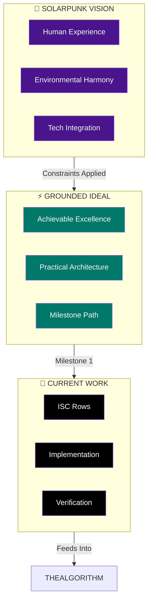
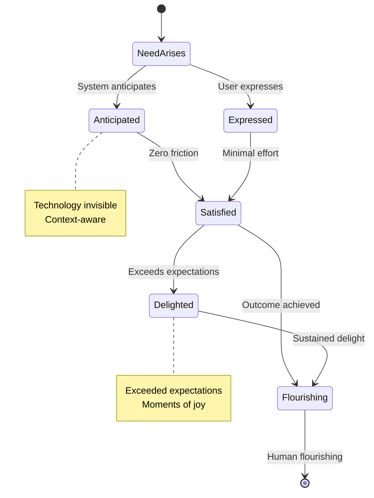
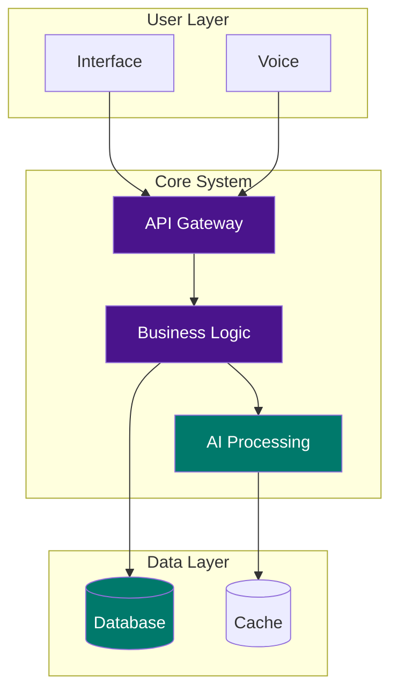
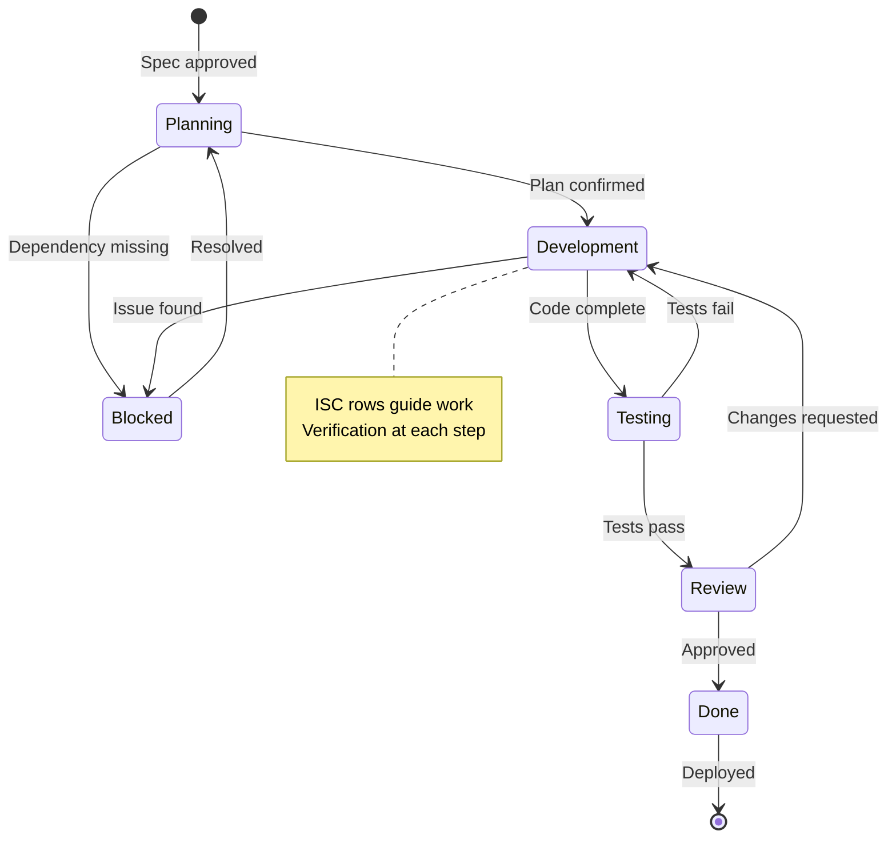

# GenerateVisionDiagram Workflow

**Generate visual diagrams for vision tier specifications using the Art skill's Mermaid workflow.**

This workflow creates Excalidraw-aesthetic Mermaid diagrams that visualize the three-tier vision hierarchy and individual spec architectures.

## Purpose

Vision specs benefit from visual representation:
- **Solarpunk Vision** → State diagram of ideal user states
- **Grounded Ideal** → Flowchart of system architecture
- **Current Work** → State diagram of implementation workflow
- **Vision Cascade** → Shows Solarpunk → Grounded → Current relationships

---

## Diagram Types

### 1. Vision Cascade Diagram

**Shows the three-tier hierarchy and how they relate.**

```
Trigger: "vision cascade diagram", "show vision hierarchy"
```

**Structure:**
```
SOLARPUNK VISION (Utopian North Star)
    │ Features categorized by achievability
    │ Non-negotiables identified
    ▼
GROUNDED IDEAL (Achievable Excellence)
    │ Technology constraints applied
    │ Milestones defined
    ▼
CURRENT WORK (Practical Path)
    │ ISC rows for execution
    │ Feeds into THEALGORITHM
```

**Mermaid Type:** Flowchart (top-to-bottom)

**Color Scheme:**
- Solarpunk: Purple (aspirational)
- Grounded: Teal (achievable)
- Current Work: Black (actionable)
- Arrows: Black with labels

---

### 2. Solarpunk Vision Diagram

**State diagram showing ideal user experience states.**

```
Trigger: "solarpunk diagram", "vision state diagram"
```

**Structure:**
```
[Initial Need] → (anticipation) → [Need Satisfied]
              → (zero friction) → [Delight State]
              → (invisible tech) → [Human Flourishing]
```

**Mermaid Type:** State Diagram

**Extraction from Solarpunk Spec:**
- User states from Section 2.1 (Anticipatory Moments)
- Transitions from Section 2.2 (Zero-Friction Interactions)
- Delight moments from Section 2.3

---

### 3. Grounded Ideal Diagram

**Flowchart showing practical system architecture.**

```
Trigger: "grounded diagram", "architecture diagram"
```

**Structure:**
```
User Interface → API Gateway → Core Logic → Data Layer
                           ↓
                    External Services
```

**Mermaid Type:** Flowchart

**Extraction from Grounded Ideal Spec:**
- Components from Section 3.1
- Integration points from Section 3.2
- Data flow from Section 3.3

---

### 4. Current Work Diagram

**State diagram showing implementation workflow.**

```
Trigger: "current work diagram", "implementation diagram"
```

**Structure:**
```
[Planning] → [Development] → [Testing] → [Review] → [Done]
                         ↓
                    [Blocked]
```

**Mermaid Type:** State Diagram

**Extraction from Current Work Spec:**
- States from implementation steps (Section 5.3)
- Verification gates (Section 6)
- ISC verification flow

---

## Execution Steps

### Step 1: Identify Spec and Diagram Type

```
Header: "Diagram Type"
Question: "What type of vision diagram do you want to create?"
Options:
- "Vision Cascade" - Show Solarpunk → Grounded → Current hierarchy
- "Solarpunk States" - Ideal user experience state diagram
- "Grounded Architecture" - System architecture flowchart
- "Current Work Flow" - Implementation workflow state diagram
```

### Step 2: Load Source Spec

Based on diagram type, load the relevant spec:

| Diagram Type | Source Spec |
|--------------|-------------|
| Vision Cascade | All three (or available subset) |
| Solarpunk States | Solarpunk Vision |
| Grounded Architecture | Grounded Ideal |
| Current Work Flow | Current Work |

```bash
# Find and load relevant specs
ls ~/.claude/Plans/Specs/*{{domain}}*.md
```

### Step 3: Extract Diagram Structure

**Run CSE-style analysis on the spec content:**

From the loaded spec, identify:
- **Nodes:** States, components, or process steps
- **Edges:** Transitions, data flows, or relationships
- **Labels:** Conditions, triggers, or descriptions
- **Emphasis:** Critical path (purple), secondary (teal)

### Step 4: Invoke Art Skill Mermaid Workflow

**Reference:** `skills/Art/Workflows/Mermaid.md`

**Key Parameters:**

```yaml
diagram_type: {{flowchart|stateDiagram-v2}}
aesthetic: excalidraw_whiteboard
color_scheme:
  critical: "#4A148C"  # Deep Purple
  secondary: "#00796B"  # Deep Teal
  structure: "#000000"  # Black
  text: "#2D2D2D"       # Charcoal
  background: "#F5E6D3" # Light Cream (or white)

aspect_ratio:
  flowchart_vertical: "9:16"
  flowchart_horizontal: "16:9"
  state_diagram: "16:9"

model: nano-banana-pro  # Best for text-heavy diagrams
```

### Step 5: Generate Diagram

**Construct comprehensive prompt following Art skill pattern:**

```
Hand-drawn Mermaid [DIAGRAM_TYPE] in Excalidraw whiteboard sketch style.

STYLE: Excalidraw hand-drawn, whiteboard sketch, wobbly shapes
BACKGROUND: Light Cream #F5E6D3

DIAGRAM STRUCTURE:
[Extracted nodes and edges from spec]

COLOR USAGE:
- Purple #4A148C: Critical/primary path
- Teal #00796B: Secondary/alternative paths
- Black #000000: Structure and arrows
- Charcoal #2D2D2D: All text labels

TYPOGRAPHY:
- Tier 1: Diagram title (Valkyrie serif italic, large)
- Tier 2: Node labels (Concourse T3, medium)
- Tier 3: Edge labels (smaller, hand-written style)

NODES:
[List each node with shape, label, color, position]

CONNECTIONS:
[List each arrow with path, label, style]

EXCALIDRAW AESTHETIC:
- Wobbly rectangles, not perfect
- Sketchy arrows with slight curves
- Hand-lettered text
- Organic connections
```

### Step 6: Save and Display

**Output location:**
```
~/.claude/Plans/Specs/Diagrams/{{domain}}-{{type}}-diagram.png
```

**Immediately open:**
```bash
open ~/.claude/Plans/Specs/Diagrams/{{domain}}-{{type}}-diagram.png
```

---

## Diagram Templates

### Vision Cascade Template



### Solarpunk States Template



### Grounded Architecture Template



### Current Work Flow Template



---

## Integration

### Uses
- **Art skill** — Mermaid workflow for generation
- **Vision tier specs** — Source content for diagrams

### Output
- PNG images in `~/.claude/Plans/Specs/Diagrams/`
- Can be embedded in specs or shared

---

## Example Usage

```
User: "Generate vision cascade diagram for PKM system"

→ Load PKM Solarpunk Vision, Grounded Ideal, Current Work specs
→ Extract key components from each tier
→ Build cascade flowchart structure
→ Invoke Art skill with Excalidraw aesthetic
→ Generate with nano-banana-pro
→ Save to ~/. claude/Plans/Specs/Diagrams/pkm-vision-cascade.png
→ Open for user review
```

```
User: "Create architecture diagram from grounded ideal"

→ Load Grounded Ideal spec
→ Extract components from Section 3
→ Build flowchart with component boxes
→ Mark critical path in purple
→ Generate with Excalidraw aesthetic
→ Save and display
```

---

**Last Updated:** 2026-02-01
