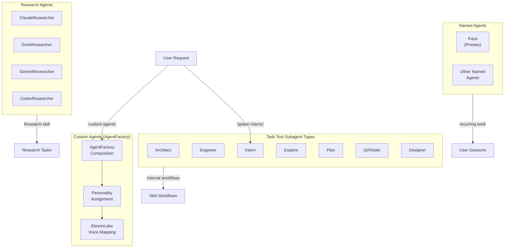

# Agent Architecture

Agent system showing Task subagents, research agents, custom agents, and named agents

**Generated:** 2026-02-01T18:31:16.281Z

```mermaid
flowchart TB
    subgraph TaskAgents["Task Tool Subagent Types"]
        direction LR
        Architect["Architect"]
        Engineer["Engineer"]
        Intern["Intern"]
        Explore["Explore"]
        Plan["Plan"]
        QATester["QATester"]
        Designer["Designer"]
    end

    subgraph ResearchAgents["Research Agents"]
        direction LR
        ClaudeRes["ClaudeResearcher"]
        GrokRes["GrokResearcher"]
        GeminiRes["GeminiResearcher"]
        CodexRes["CodexResearcher"]
    end

    subgraph CustomAgents["Custom Agents (AgentFactory)"]
        Factory["AgentFactory<br/>Composition"]
        Personality["Personality<br/>Assignment"]
        Voice["ElevenLabs<br/>Voice Mapping"]
    end

    subgraph NamedAgents["Named Agents"]
        Kaya["Kaya<br/>(Primary)"]
        Others["Other Named<br/>Agents"]
    end

    %% Relationships
    TaskAgents -->|"internal workflows"| Workflows["Skill Workflows"]
    ResearchAgents -->|"Research skill"| Research["Research Tasks"]
    Factory --> Personality --> Voice
    NamedAgents -->|"recurring work"| Sessions["User Sessions"]

    User["User Request"] -->|"'custom agents'"| Factory
    User -->|"'spawn interns'"| Intern

    classDef task fill:#1e3a5f,stroke:#93c5fd,color:#fff
    classDef research fill:#064e3b,stroke:#6ee7b7,color:#fff
    classDef custom fill:#4c1d95,stroke:#c4b5fd,color:#fff
    classDef named fill:#7c2d12,stroke:#fdba74,color:#fff
```
