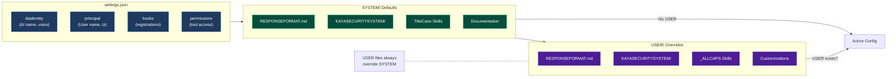

# Configuration Flow

Configuration inheritance from settings.json through SYSTEM/USER tiers

**Generated:** 2026-02-01T18:31:16.281Z

```mermaid
flowchart LR
    subgraph Settings["settings.json"]
        Identity["daidentity<br/>(AI name, voice)"]
        Principal["principal<br/>(User name, tz)"]
        HookConfig["hooks<br/>(registrations)"]
        Permissions["permissions<br/>(tool access)"]
    end

    subgraph SYSTEM["SYSTEM/ Defaults"]
        SysResponse["RESPONSEFORMAT.md"]
        SysSecurity["KAYASECURITYSYSTEM/"]
        SysSkills["TitleCase Skills"]
        SysDocs["Documentation"]
    end

    subgraph USER["USER/ Overrides"]
        UserResponse["RESPONSEFORMAT.md"]
        UserSecurity["KAYASECURITYSYSTEM/"]
        UserSkills["_ALLCAPS Skills"]
        UserCustom["Customizations"]
    end

    Settings --> SYSTEM
    SYSTEM --> USER

    USER -->|"USER exists?"| Final["Active Config"]
    SYSTEM -->|"No USER"| Final

    Note["USER files always<br/>override SYSTEM"] -.- USER

    classDef settings fill:#1e3a5f,stroke:#93c5fd,color:#fff
    classDef system fill:#064e3b,stroke:#6ee7b7,color:#fff
    classDef user fill:#4c1d95,stroke:#c4b5fd,color:#fff

    class Identity,Principal,HookConfig,Permissions settings
    class SysResponse,SysSecurity,SysSkills,SysDocs system
    class UserResponse,UserSecurity,UserSkills,UserCustom user
```
