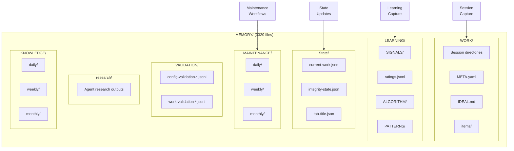

# Memory Structure

MEMORY/ directory organization and data flow

**Generated:** 2026-02-01T18:31:16.281Z

```mermaid
flowchart TB
    subgraph MEMORY["MEMORY/ (3320 files)"]
        direction TB

        subgraph WORK["WORK/"]
            WorkSession["Session directories"]
            WorkMeta["META.yaml"]
            WorkIdeal["IDEAL.md"]
            WorkItems["items/"]
        end

        subgraph LEARNING["LEARNING/"]
            Signals["SIGNALS/"]
            Ratings["ratings.jsonl"]
            Algorithm["ALGORITHM/"]
            Patterns["PATTERNS/"]
        end

        subgraph STATE["State/"]
            CurrentWork["current-work.json"]
            IntegrityState["integrity-state.json"]
            TabTitle["tab-title.json"]
        end

        subgraph MAINTENANCE["MAINTENANCE/"]
            Daily["daily/"]
            Weekly["weekly/"]
            Monthly["monthly/"]
        end

        subgraph VALIDATION["VALIDATION/"]
            ConfigVal["config-validation-*.jsonl"]
            WorkVal["work-validation-*.jsonl"]
        end

        subgraph RESEARCH["research/"]
            ResearchOut["Agent research outputs"]
        end

        subgraph KNOWLEDGE["KNOWLEDGE/"]
            KnowDaily["daily/"]
            KnowWeekly["weekly/"]
            KnowMonthly["monthly/"]
        end
    end

    %% Data flows
    SessionCapture["Session<br/>Capture"] --> WORK
    LearningCapture["Learning<br/>Capture"] --> LEARNING
    StateUpdates["State<br/>Updates"] --> STATE
    MaintenanceRuns["Maintenance<br/>Workflows"] --> MAINTENANCE

    classDef memory fill:#4c1d95,stroke:#c4b5fd,color:#fff
    classDef flow fill:#1e3a5f,stroke:#93c5fd,color:#fff
```
