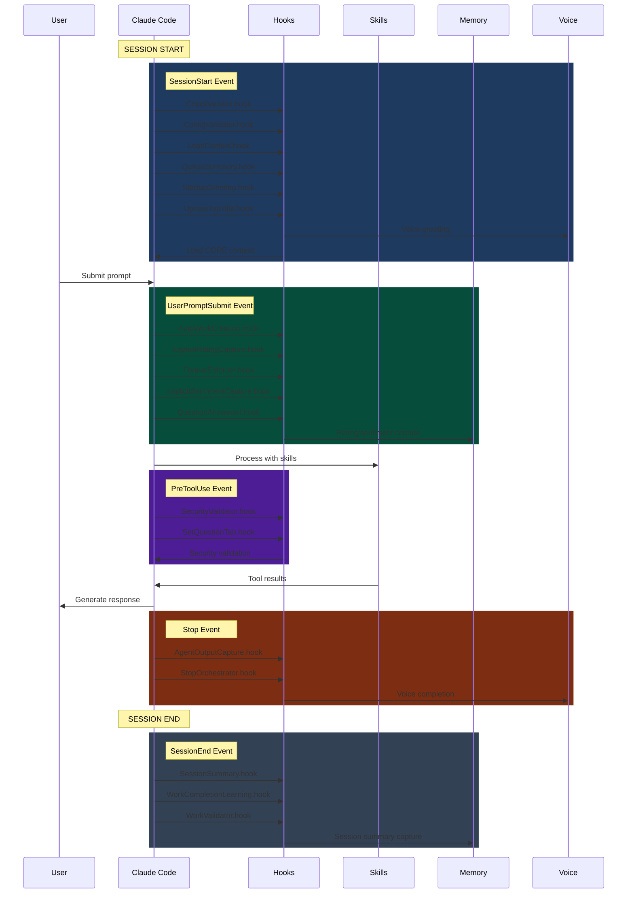

# Session Lifecycle

Session lifecycle showing hook execution order from start to end

**Generated:** 2026-02-01T18:31:16.281Z

```mermaid
sequenceDiagram
    participant U as User
    participant CC as Claude Code
    participant H as Hooks
    participant S as Skills
    participant M as Memory
    participant V as Voice

    Note over CC: SESSION START

    rect rgb(30, 58, 95)
    Note right of CC: SessionStart Event
        CC->>H: CheckVersion.hook
        CC->>H: ConfigValidator.hook
        CC->>H: LoadContext.hook
        CC->>H: QueueSummary.hook
        CC->>H: StartupGreeting.hook
        CC->>H: UpdateTabTitle.hook
    H->>V: Voice greeting
    H->>CC: Load CORE context
    end

    U->>CC: Submit prompt

    rect rgb(6, 78, 59)
    Note right of CC: UserPromptSubmit Event
        CC->>H: AutoWorkCreation.hook
        CC->>H: ExplicitRatingCapture.hook
        CC->>H: FormatEnforcer.hook
        CC->>H: ImplicitSentimentCapture.hook
        CC->>H: QuestionAnswered.hook
    H->>M: Rating/sentiment capture
    end

    CC->>S: Process with skills

    rect rgb(76, 29, 149)
    Note right of CC: PreToolUse Event
        CC->>H: SecurityValidator.hook
        CC->>H: SetQuestionTab.hook
    H->>CC: Security validation
    end

    S->>CC: Tool results
    CC->>U: Generate response

    rect rgb(124, 45, 18)
    Note right of CC: Stop Event
        CC->>H: AgentOutputCapture.hook
        CC->>H: StopOrchestrator.hook
    H->>V: Voice completion
    end

    Note over CC: SESSION END

    rect rgb(51, 65, 85)
    Note right of CC: SessionEnd Event
        CC->>H: SessionSummary.hook
        CC->>H: WorkCompletionLearning.hook
        CC->>H: WorkValidator.hook
    H->>M: Session summary capture
    end
```
