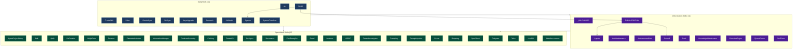

# Skill Ecosystem

Skill ecosystem organized by Meta/Orchestration/Specialized categories

**Generated:** 2026-02-01T18:31:16.281Z

```mermaid
flowchart TB
    subgraph Meta["Meta Skills (11)"]
        direction LR
        Art["Art"]
        CORE["CORE"]
        CreateSkill["CreateSkill"]
        Fabric["Fabric"]
        GeminiSync["GeminiSync"]
        PAISync["PAISync"]
        KayaUpgrade["KayaUpgrade"]
        Research["Research"]
        SkillAudit["SkillAudit"]
        System["System"]
        SystemFlowchart["SystemFlowchart"]
    end

    subgraph Orchestration["Orchestration Skills (11)"]
        direction LR
        RALPHLOOP["_RALPHLOOP"]
        Agents["Agents"]
        AutoMaintenance["AutoMaintenance"]
        AutonomousWork["AutonomousWork"]
        Council["Council"]
        Evals["Evals"]
        KnowledgeMaintenance["KnowledgeMaintenance"]
        ProactiveEngine["ProactiveEngine"]
        QueueRouter["QueueRouter"]
        RedTeam["RedTeam"]
        THEALGORITHM["THEALGORITHM"]
    end

    subgraph Specialized["Specialized Skills (27)"]
        direction TB
        AgentProjectSetup["AgentProjectSetup"]
        Anki["Anki"]
        Apify["Apify"]
        BeCreative["BeCreative"]
        BrightData["BrightData"]
        Browser["Browser"]
        CalendarAssistant["CalendarAssistant"]
        InformationManager["InformationManager"]
        ContinualLearning["ContinualLearning"]
        Cooking["Cooking"]
        CreateCLI["CreateCLI"]
        Designer["Designer"]
        Documents["Documents"]
        FirstPrinciples["FirstPrinciples"]
        Gmail["Gmail"]
        Instacart["Instacart"]
        OSINT["OSINT"]
        PrivateInvestigator["PrivateInvestigator"]
        Prompting["Prompting"]
        PromptInjection["PromptInjection"]
        Recon["Recon"]
        Shopping["Shopping"]
        SpecSheet["SpecSheet"]
        Telegram["Telegram"]
        Telos["Telos"]
        UnixCLI["UnixCLI"]
        WebAssessment["WebAssessment"]
    end

    %% Category relationships
    Meta --> Orchestration
    Meta --> Specialized
    Orchestration --> Specialized

    %% Key dependencies
    CORE --> System
    CORE --> THEALGORITHM
    THEALGORITHM --> Agents
    THEALGORITHM --> Council

    classDef meta fill:#1e3a5f,stroke:#93c5fd,color:#fff
    classDef orch fill:#4c1d95,stroke:#c4b5fd,color:#fff
    classDef spec fill:#064e3b,stroke:#6ee7b7,color:#fff

    class Art,CORE,CreateSkill,Fabric,GeminiSync,PAISync,KayaUpgrade,Research,SkillAudit,System,SystemFlowchart meta
    class RALPHLOOP,Agents,AutoMaintenance,AutonomousWork,Council,Evals,KnowledgeMaintenance,ProactiveEngine,QueueRouter,RedTeam,THEALGORITHM orch
    class AgentProjectSetup,Anki,Apify,BeCreative,BrightData,Browser,CalendarAssistant,InformationManager,ContinualLearning,Cooking,CreateCLI,Designer,Documents,FirstPrinciples,Gmail,Instacart,OSINT,PrivateInvestigator,Prompting,PromptInjection,Recon,Shopping,SpecSheet,Telegram,Telos,UnixCLI,WebAssessment spec
```
