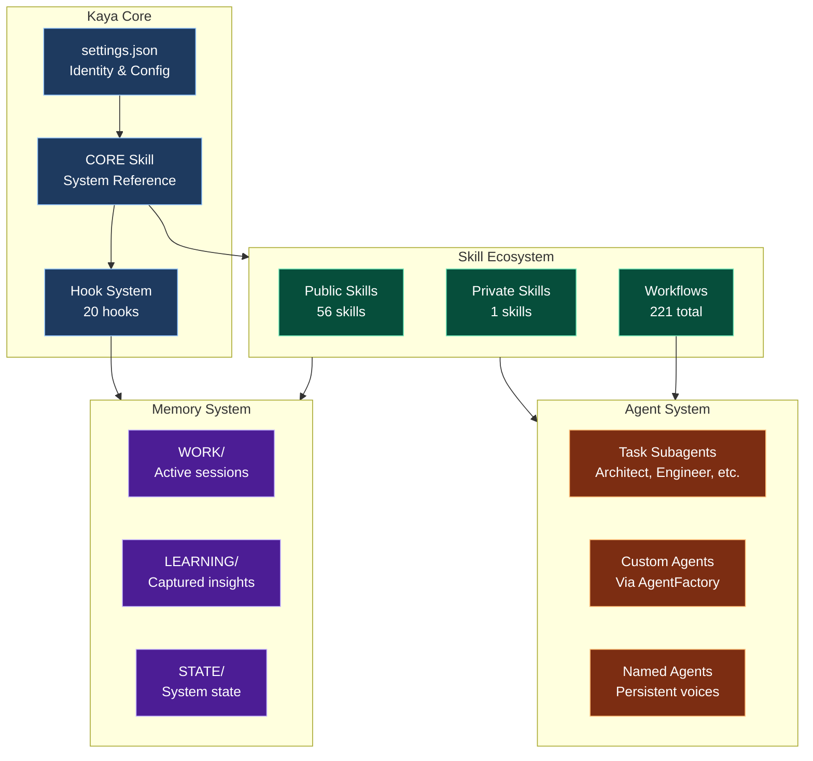

# System Overview

High-level Kaya system architecture showing core components and relationships

**Generated:** 2026-02-01T18:31:16.281Z

```mermaid
flowchart TB
    subgraph Core["Kaya Core"]
        Settings["settings.json<br/>Identity & Config"]
        CORE["CORE Skill<br/>System Reference"]
        Hooks["Hook System<br/>20 hooks"]
    end

    subgraph Skills["Skill Ecosystem"]
        Public["Public Skills<br/>56 skills"]
        Private["Private Skills<br/>1 skills"]
        Workflows["Workflows<br/>221 total"]
    end

    subgraph Memory["Memory System"]
        WORK["WORK/<br/>Active sessions"]
        LEARNING["LEARNING/<br/>Captured insights"]
        STATE["STATE/<br/>System state"]
    end

    subgraph Agents["Agent System"]
        TaskAgents["Task Subagents<br/>Architect, Engineer, etc."]
        CustomAgents["Custom Agents<br/>Via AgentFactory"]
        NamedAgents["Named Agents<br/>Persistent voices"]
    end

    Settings --> CORE
    CORE --> Hooks
    CORE --> Skills
    Hooks --> Memory
    Skills --> Agents
    Skills --> Memory
    Workflows --> Agents

    classDef core fill:#1e3a5f,stroke:#93c5fd,color:#fff
    classDef skills fill:#064e3b,stroke:#6ee7b7,color:#fff
    classDef memory fill:#4c1d95,stroke:#c4b5fd,color:#fff
    classDef agents fill:#7c2d12,stroke:#fdba74,color:#fff

    class Settings,CORE,Hooks core
    class Public,Private,Workflows skills
    class WORK,LEARNING,STATE memory
    class TaskAgents,CustomAgents,NamedAgents agents
```
