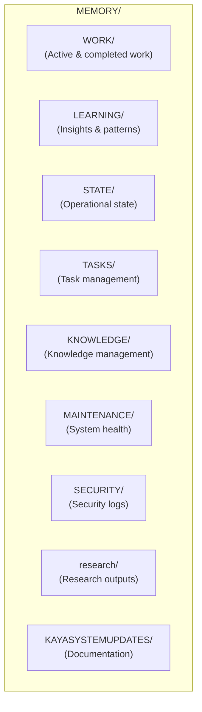
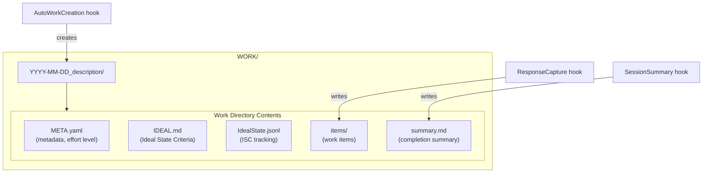
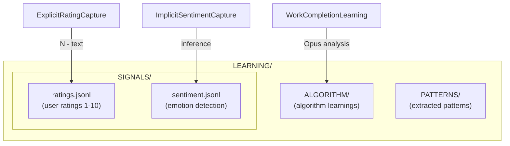
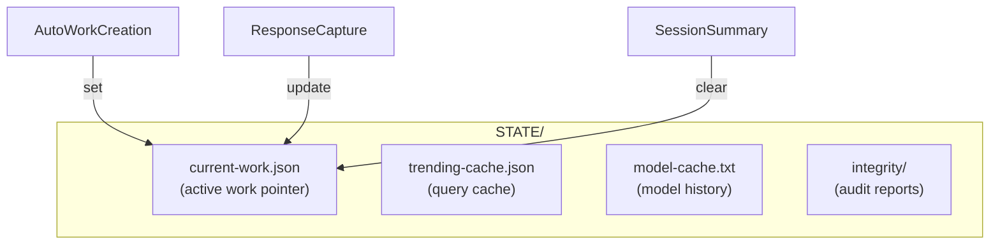
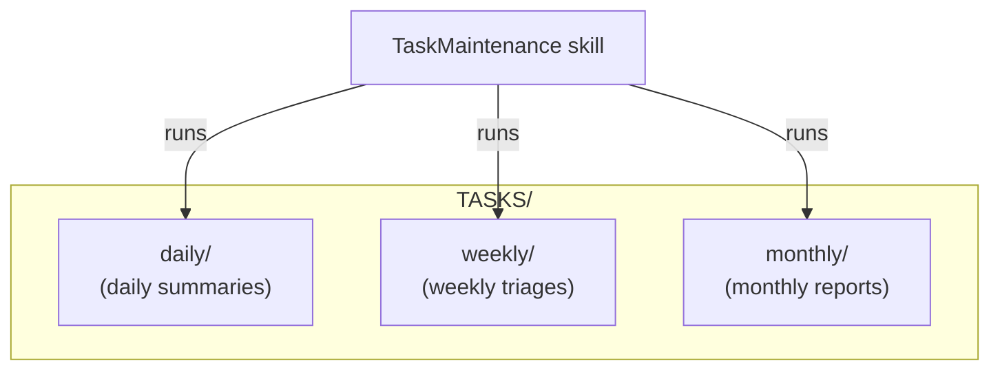
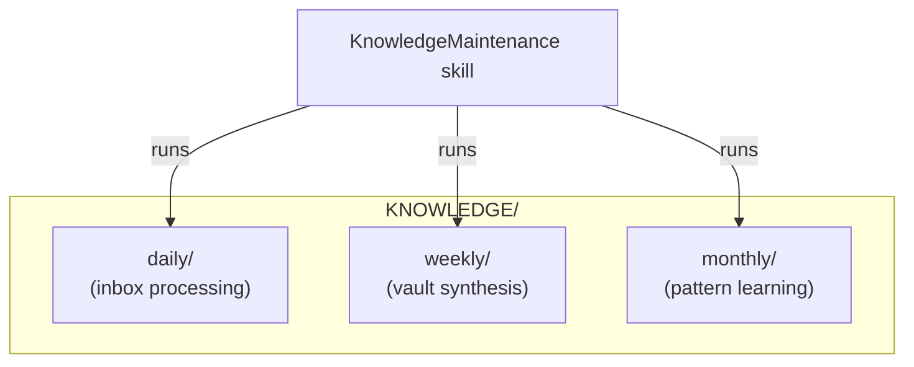
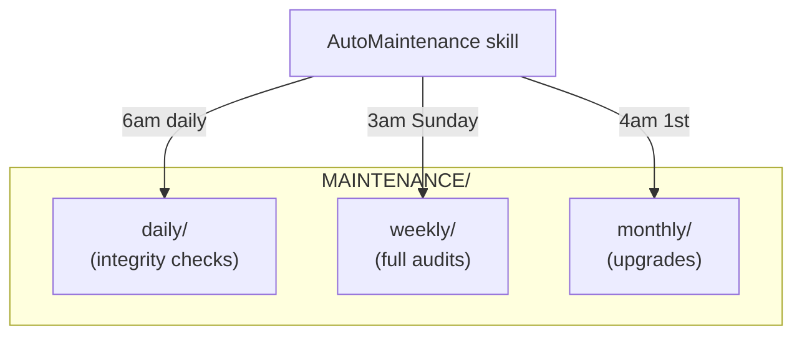
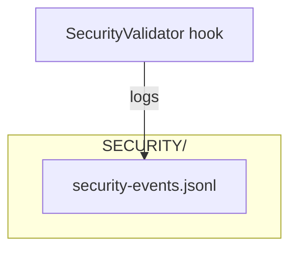
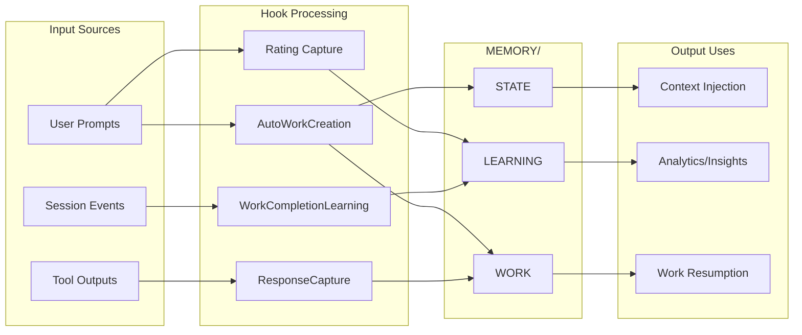

# MemoryStructure Workflow

**Purpose:** Generate a diagram showing the MEMORY/ directory structure, data flow, and how different components write to and read from memory.

---

## Quick Start

```bash
# Generate memory structure diagram
bun ~/.claude/skills/SystemFlowchart/Tools/DiagramBuilder.ts memory

# Scan memory for details
bun ~/.claude/skills/SystemFlowchart/Tools/SystemScanner.ts memory
```

---

## Workflow Steps

### Step 1: Scan Memory Directory

Use SystemScanner to analyze memory structure:

```bash
bun ~/.claude/skills/SystemFlowchart/Tools/SystemScanner.ts memory
```

Returns JSON with directories, file counts, and structure.

### Step 2: Generate Memory Diagram

Use DiagramBuilder to generate the flowchart:

```bash
bun ~/.claude/skills/SystemFlowchart/Tools/DiagramBuilder.ts memory
```

Output: `Output/markdown/memory-structure.md`

### Step 3: Generate PNG (Optional)

```bash
bun ~/.claude/skills/SystemFlowchart/Tools/ArtBridge.ts generate \
  --title "Kaya Memory System" \
  --file Output/markdown/memory-structure.md \
  --output ~/Downloads/memory-structure.png
```

---

## Detailed Memory Structure Documentation

Create `~/.claude/skills/SystemFlowchart/Output/MEMORY_STRUCTURE.md`:

```markdown
# Kaya Memory System Architecture

**Generated:** [TIMESTAMP]
**Total Files:** [count]
**Total Directories:** [count]

---

## Memory System Overview

The MEMORY/ directory is Kaya's persistent storage for work sessions, learnings, signals, and state. It enables intelligence to compound across sessions.



---

## Directory Structure Detail

### WORK/ - Work Sessions



**Work Directory Lifecycle:**
1. `AutoWorkCreation` creates directory on prompt submit
2. `ResponseCapture` saves responses to `items/`
3. `SessionSummary` adds `summary.md` at session end

### LEARNING/ - Insights & Patterns



**Signal Capture:**
- **Explicit ratings:** Pattern "8 - great!" → parsed and stored
- **Implicit sentiment:** Haiku inference on emotional content
- **Learnings:** Opus analysis of session at SessionEnd

### STATE/ - Operational State



**current-work.json Schema:**
```json
{
  "active_work_dir": "MEMORY/WORK/2025-01-20_task-description/",
  "current_item": 1,
  "status": "in_progress" | "completed",
  "started_at": "ISO timestamp"
}
```

### TASKS/ - Task Management



### KNOWLEDGE/ - Knowledge Management



### MAINTENANCE/ - System Health



### SECURITY/ - Security Logs



---

## Data Flow Diagram



---

## File Formats Reference

| File | Format | Purpose |
|------|--------|---------|
| `META.yaml` | YAML | Work metadata, effort level |
| `IDEAL.md` | Markdown | Ideal State Criteria definition |
| `IdealState.jsonl` | JSONL | ISC item tracking |
| `ratings.jsonl` | JSONL | User rating signals |
| `current-work.json` | JSON | Active work pointer |
| `security-events.jsonl` | JSONL | Security audit log |
| `summary.md` | Markdown | Work session summary |

---

## Hook → Memory Mapping

| Hook | Writes To | Reads From |
|------|-----------|-----------|
| AutoWorkCreation | WORK/, STATE/current-work.json | — |
| ResponseCapture | WORK/items/, STATE/current-work.json | STATE/current-work.json |
| ExplicitRatingCapture | LEARNING/SIGNALS/ratings.jsonl | — |
| ImplicitSentimentCapture | LEARNING/SIGNALS/ratings.jsonl | LEARNING/SIGNALS/ratings.jsonl |
| SecurityValidator | SECURITY/security-events.jsonl | patterns.yaml |
| WorkCompletionLearning | LEARNING/ALGORITHM/ | transcript |
| SessionSummary | WORK/summary.md, STATE/ | STATE/current-work.json |
| LoadContext | — | STATE/current-work.json |
```

### Step 3: Save and Announce

```bash
mkdir -p ~/.claude/skills/SystemFlowchart/Output
# Write document
open ~/.claude/skills/SystemFlowchart/Output/MEMORY_STRUCTURE.md
```

Voice notification:
```bash
curl -s -X POST http://localhost:8888/notify \
  -H "Content-Type: application/json" \
  -d '{"message": "Memory structure diagram generated"}' \
  > /dev/null 2>&1 &
```
