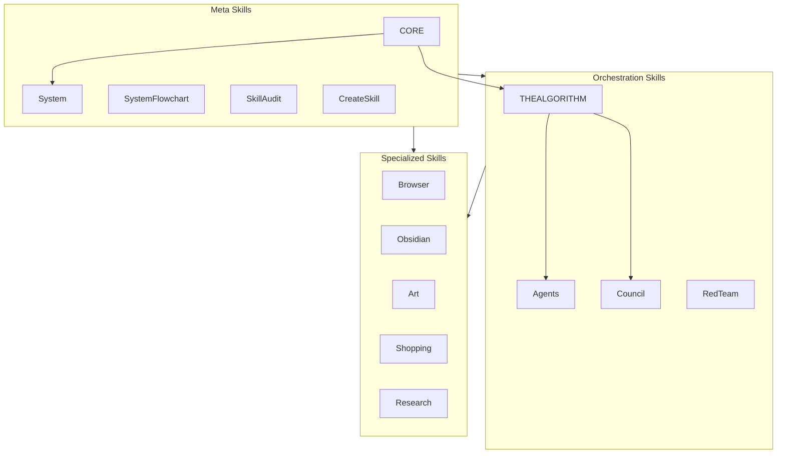

# SkillMap Workflow

**Purpose:** Generate a comprehensive diagram showing skill hierarchy, dependencies, and the new Meta/Orchestration/Specialized categorization.

---

## Overview

This workflow uses the new SkillCategorizer to organize skills into three categories:

| Category | Purpose | Examples |
|----------|---------|----------|
| **Meta** | Skills about skills/system | CORE, System, SkillAudit, CreateSkill |
| **Orchestration** | Coordination engines | THEALGORITHM, Agents, Council, RedTeam |
| **Specialized** | Domain functionality | Browser, Obsidian, Art, Shopping |

---

## Workflow Steps

### Step 1: Run Skill Categorization

```bash
# Full categorization with reasoning
bun ~/.claude/skills/SystemFlowchart/Tools/SkillCategorizer.ts

# JSON output for programmatic use
bun ~/.claude/skills/SystemFlowchart/Tools/SkillCategorizer.ts --json

# Mermaid diagram output
bun ~/.claude/skills/SystemFlowchart/Tools/SkillCategorizer.ts --diagram
```

### Step 2: Generate Skill Ecosystem Diagram

Use DiagramBuilder to generate the categorized skill map:

```bash
bun ~/.claude/skills/SystemFlowchart/Tools/DiagramBuilder.ts ecosystem
```

This generates a Mermaid flowchart with:
- Skills grouped by Meta/Orchestration/Specialized
- Color-coded by category
- Key dependency relationships shown

### Step 3: Scan for Additional Details

For detailed skill information:

```bash
bun ~/.claude/skills/SystemFlowchart/Tools/SystemScanner.ts skills
```

Returns JSON with:
- Skill name and directory
- Description and USE WHEN triggers
- Workflows and tools count
- Dependencies on other skills
- Private vs public status

### Step 4: Save Output

The ecosystem diagram is saved to:
`Output/markdown/skill-ecosystem.md`

For PNG generation:
```bash
bun ~/.claude/skills/SystemFlowchart/Tools/ArtBridge.ts generate \
  --title "Kaya Skill Ecosystem" \
  --subtitle "Meta / Orchestration / Specialized" \
  --file Output/markdown/skill-ecosystem.md \
  --output ~/Downloads/skill-ecosystem.png
```

---

## Category Definitions

### Meta Skills
Skills about skills and the system itself. Infrastructure, configuration, visualization.

| Skill | Purpose |
|-------|---------|
| CORE | System config, identity, security reference |
| System | Integrity checks, documentation, maintenance |
| SystemFlowchart | Architecture visualization |
| SkillAudit | Skill analysis and evaluation |
| CreateSkill | Skill creation and validation |
| KayaSync | Upstream sync from Kaya repo |
| KayaUpgrade | System improvements from content |
| GeminiSync | Sync to Gemini CLI |

### Orchestration Skills
Coordination and execution engines. Multi-agent, workflows, scheduling.

| Skill | Purpose |
|-------|---------|
| THEALGORITHM | Universal execution via ISC |
| Agents | Custom agent composition |
| Council | Multi-agent debate |
| RedTeam | Adversarial analysis |
| _RALPHLOOP | Autonomous iteration |
| AutoMaintenance | Scheduled workflows |
| KnowledgeMaintenance | Knowledge workflows |
| ProactiveEngine | Scheduled automation |
| QueueRouter | Task routing |
| AutonomousWork | Work queue execution |

### Specialized Skills
Domain-specific functionality. Everything else.

Examples: Research, Obsidian, Browser, Art, Shopping, Cooking, Gmail, Calendar, etc.

---

## Diagram Output

The generated diagram includes:



---

## CLI Quick Reference

```bash
# Categorize all skills
bun SkillCategorizer.ts

# Generate ecosystem diagram
bun DiagramBuilder.ts ecosystem

# Full skill scan
bun SystemScanner.ts skills

# Generate PNG
bun ArtBridge.ts generate --diagram ecosystem --output ~/Downloads/skills.png
```

---

## Integration

### Uses
- `Tools/SkillCategorizer.ts` - Category assignment logic
- `Tools/SystemScanner.ts` - Skill metadata scanning
- `Tools/DiagramBuilder.ts` - Mermaid generation

### Feeds Into
- `GenerateArchitecture.md` - Master architecture document
- `CORE/USER/PAI_ARCHITECTURE.md` - Architecture reference
